filtered\_heatmapping
================
yurkovkirill
05 01 2021

``` r
# setup

#install.packages("RSQLite")
#devtools::install_github("r-dbi/RSQLite")
library(DBI)
library(ggplot2)
library(dplyr)
```

    ## 
    ## Attaching package: 'dplyr'

    ## The following objects are masked from 'package:stats':
    ## 
    ##     filter, lag

    ## The following objects are masked from 'package:base':
    ## 
    ##     intersect, setdiff, setequal, union

``` r
#install.packages("tidyverse")
#install.packages("stringr")
#library(tidyverse) # for tibble and others
#library(stringr)

setwd("D:/MyFilesDesktop/Student/7SEM/DataScience/DS_Project")
con <- dbConnect(RSQLite::SQLite(), ":memory:")
dbListTables(con)
```

    ## character(0)

``` r
options(max.print=10000)

# init database
dbWriteTable(con, "games", read.csv("data/games.csv"))


####
# Add additional column for statistic:
# -success'
plays <- read.csv("data/plays.csv")
plays$success <- 0
plays$success[plays$playResult >= plays$yardsToGo] <- 1
dbWriteTable(con, "plays", plays)

####
dbWriteTable(con, "allWeeks", read.csv("data/week1.csv"))
dbListFields(con, "allWeeks")
```

    ##  [1] "time"          "x"             "y"             "s"            
    ##  [5] "a"             "dis"           "o"             "dir"          
    ##  [9] "event"         "nflId"         "displayName"   "jerseyNumber" 
    ## [13] "position"      "frameId"       "team"          "gameId"       
    ## [17] "playId"        "playDirection" "route"

``` r
dbAppendTable(con, "allWeeks", read.csv("data/week2.csv"))
```

    ## [1] 1231793

``` r
dbAppendTable(con, "allWeeks", read.csv("data/week3.csv"))
```

    ## [1] 1168345

``` r
dbAppendTable(con, "allWeeks", read.csv("data/week4.csv"))
```

    ## [1] 1205527

``` r
dbAppendTable(con, "allWeeks", read.csv("data/week5.csv"))
```

    ## [1] 1171908

``` r
dbAppendTable(con, "allWeeks", read.csv("data/week6.csv"))
```

    ## [1] 1072563

``` r
dbAppendTable(con, "allWeeks", read.csv("data/week7.csv"))
```

    ## [1] 982583

``` r
dbAppendTable(con, "allWeeks", read.csv("data/week8.csv"))
```

    ## [1] 1001501

``` r
dbAppendTable(con, "allWeeks", read.csv("data/week9.csv"))
```

    ## [1] 958464

``` r
dbAppendTable(con, "allWeeks", read.csv("data/week10.csv"))
```

    ## [1] 964889

``` r
dbAppendTable(con, "allWeeks", read.csv("data/week11.csv"))
```

    ## [1] 932240

``` r
dbAppendTable(con, "allWeeks", read.csv("data/week12.csv"))
```

    ## [1] 1024868

``` r
dbAppendTable(con, "allWeeks", read.csv("data/week13.csv"))
```

    ## [1] 1172517

``` r
dbAppendTable(con, "allWeeks", read.csv("data/week14.csv"))
```

    ## [1] 1161644

``` r
dbAppendTable(con, "allWeeks", read.csv("data/week15.csv"))
```

    ## [1] 1081222

``` r
dbAppendTable(con, "allWeeks", read.csv("data/week16.csv"))
```

    ## [1] 1144037

``` r
dbAppendTable(con, "allWeeks", read.csv("data/week17.csv"))
```

    ## [1] 1049265

``` r
dbGetQuery(con, "SELECT COUNT(*) FROM allWeeks")
```

    ##   COUNT(*)
    ## 1 18309388

``` r
dbListTables(con)
```

    ## [1] "allWeeks" "games"    "plays"

``` r
#dbRemoveTable(con, "games")
#dbRemoveTable(con, "plays")
#dbRemoveTable(con, "allWeeks")


# USE IT
# 1) Берем координаты мяча в момент ball_snap (и считаем относительно него, ориентируясь по playDirection)
# 2) Пересчет их координат относительно


# нужно отобрать всех игроков в моменте, посмотрим не пропадают ли

testTeam <- head(dbGetQuery(con, "SELECT DISTINCT w.nflId, w.team FROM plays as p JOIN allWeeks as w ON p.gameId = w.gameId
                                      AND p.playId = w.playId WHERE w.gameId = 2018090600
                                      ORDER BY w.nflId"),12)#w.event = 'ball_snap'")
testTeam
```

    ##      nflId     team
    ## 1       NA football
    ## 2      310     away
    ## 3    79848     home
    ## 4  2495454     away
    ## 5  2495613     home
    ## 6  2506467     home
    ## 7  2507763     home
    ## 8  2507828     away
    ## 9  2532842     home
    ## 10 2533040     away
    ## 11 2534832     home
    ## 12 2539291     home

``` r
# этот запрос дал нам понять, что команда у игрока во время игры не меняется, но мы знаем что меняется сторона

testFrames <- head(dbGetQuery(con, "SELECT w.frameId, w.playId, COUNT(w.nflId), COUNT(w.displayName) FROM plays as p JOIN allWeeks as w ON p.gameId = w.gameId
                                      AND p.playId = w.playId WHERE w.gameId = 2018090600
                                      GROUP BY w.frameId, w.playId ORDER BY w.playId"),60)#w.event = 'ball_snap'")
options(max.print=10000)
testFrames
```

    ##    frameId playId COUNT(w.nflId) COUNT(w.displayName)
    ## 1        1     75             13                   14
    ## 2        2     75             13                   14
    ## 3        3     75             13                   14
    ## 4        4     75             13                   14
    ## 5        5     75             13                   14
    ## 6        6     75             13                   14
    ## 7        7     75             13                   14
    ## 8        8     75             13                   14
    ## 9        9     75             13                   14
    ## 10      10     75             13                   14
    ## 11      11     75             13                   14
    ## 12      12     75             13                   14
    ## 13      13     75             13                   14
    ## 14      14     75             13                   14
    ## 15      15     75             13                   14
    ## 16      16     75             13                   14
    ## 17      17     75             13                   14
    ## 18      18     75             13                   14
    ## 19      19     75             13                   14
    ## 20      20     75             13                   14
    ## 21      21     75             13                   14
    ## 22      22     75             13                   14
    ## 23      23     75             13                   14
    ## 24      24     75             13                   14
    ## 25      25     75             13                   14
    ## 26      26     75             13                   14
    ## 27      27     75             13                   14
    ## 28      28     75             13                   14
    ## 29      29     75             13                   14
    ## 30      30     75             13                   14
    ## 31      31     75             13                   14
    ## 32      32     75             13                   14
    ## 33      33     75             13                   14
    ## 34      34     75             13                   14
    ## 35      35     75             13                   14
    ## 36      36     75             13                   14
    ## 37      37     75             13                   14
    ## 38      38     75             13                   14
    ## 39      39     75             13                   14
    ## 40      40     75             13                   14
    ## 41      41     75             13                   14
    ## 42      42     75             13                   14
    ## 43      43     75             13                   14
    ## 44      44     75             13                   14
    ## 45      45     75             13                   14
    ## 46      46     75             13                   14
    ## 47      47     75             13                   14
    ## 48      48     75             13                   14
    ## 49      49     75             13                   14
    ## 50      50     75             13                   14
    ## 51      51     75             13                   14
    ## 52      52     75             13                   14
    ## 53      53     75             13                   14
    ## 54      54     75             13                   14
    ## 55      55     75             13                   14
    ## 56      56     75             13                   14
    ## 57      57     75             13                   14
    ## 58      58     75             13                   14
    ## 59      59     75             13                   14
    ## 60       1    146             13                   14

``` r
# этот запрос показал, что количество игроков каждом фрейме одного момента одинаковое, поэтому смело можно брать
# ball_snap кадр и мы получим данные о всех зафиксированных игроках в моменте

################################################################################################################
# Обработка данных
################################################################################################################
# информация о защитниках с относительными координатами
##### Нормальный отбор по команде нападения BEGIN
# QUERIES for teams ########################
dbExecute(con, "UPDATE plays as p SET possessionTeam = 'away'
                WHERE possessionTeam != (SELECT homeTeamAbbr FROM games as g WHERE p.gameId = g.gameId)")
```

    ## [1] 9621

``` r
dbExecute(con, "UPDATE plays as p SET possessionTeam = 'home'
                WHERE possessionTeam = (SELECT homeTeamAbbr FROM games as g WHERE p.gameId = g.gameId)")
```

    ## [1] 9618

``` r
testTeam1 <- dbGetQuery(con, "SELECT team, COUNT(DISTINCT(playId)) FROM allWeeks as w GROUP BY team")
testTeam1
```

    ##       team COUNT(DISTINCT(playId))
    ## 1     away                    4591
    ## 2 football                    4592
    ## 3     home                    4592

``` r
# проверка
testTeamPlay <- dbGetQuery(con, "SELECT possessionTeam, COUNT(DISTINCT(playId)) FROM plays GROUP BY possessionTeam")
testTeamPlay
```

    ##   possessionTeam COUNT(DISTINCT(playId))
    ## 1           away                    3973
    ## 2           home                    3992

``` r
#######################################################################################################################
# берем информацию по мячу ## MAIN QUERY for init point (ball)
#######################################################################################################################

dbListFields(con, "plays")
```

    ##  [1] "gameId"                 "playId"                 "playDescription"       
    ##  [4] "quarter"                "down"                   "yardsToGo"             
    ##  [7] "possessionTeam"         "playType"               "yardlineSide"          
    ## [10] "yardlineNumber"         "offenseFormation"       "personnelO"            
    ## [13] "defendersInTheBox"      "numberOfPassRushers"    "personnelD"            
    ## [16] "typeDropback"           "preSnapVisitorScore"    "preSnapHomeScore"      
    ## [19] "gameClock"              "absoluteYardlineNumber" "penaltyCodes"          
    ## [22] "penaltyJerseyNumbers"   "passResult"             "offensePlayResult"     
    ## [25] "playResult"             "epa"                    "isDefensivePI"         
    ## [28] "success"

``` r
# football_inSnap1 <- dbGetQuery(con, "SELECT p.epa, w.x as x_b, w.y as y_b, w.displayName, w.event, w.playId,
#                                       w.gameId, p.offenseFormation, p.possessionTeam, p.yardlineNumber
#                                       FROM plays as p JOIN allWeeks as w ON p.gameId = w.gameId
#                                       AND p.playId = w.playId WHERE w.event = 'ball_snap' AND w.displayName = 'Football'")
dbWriteTable(con, "football_inSnap1", dbGetQuery(con, "SELECT p.epa, w.x as x_b, w.y as y_b, w.displayName, w.event, w.playId,
                                      w.gameId, p.offenseFormation, p.possessionTeam, p.yardlineNumber, p.success
                                      FROM plays as p JOIN allWeeks as w ON p.gameId = w.gameId
                                      AND p.playId = w.playId WHERE w.event = 'ball_snap' AND w.displayName = 'Football'"))
dbListFields(con, "football_inSnap1")
```

    ##  [1] "epa"              "x_b"              "y_b"              "displayName"     
    ##  [5] "event"            "playId"           "gameId"           "offenseFormation"
    ##  [9] "possessionTeam"   "yardlineNumber"   "success"

``` r
#dbRemoveTable(con, "football_inSnap1")

############################ PLOT FUNC DEF #####################
relGraphs <- function(df, strBest, strWin, strBestWin){
  summary(df)
  dfBest <- df[df$epa < summary(df$epa)[[2]],]
  dfWin <- df[df$success == 0,]
  dfBestWin <- df[df$epa < summary(df$epa)[[2]] & df$success == 0,]
  
  if(nrow(dfBest) > 1){
    dfBestPlot <- dfBest %>% 
      ggplot(aes(x = x_rel, y = y_rel)) +
      geom_density2d_filled(contour_var = "ndensity", breaks = seq(0.2, 1.0, length.out = 10)) + 
      labs(title=strBest)
  } else {
    dfBestPlot <- dfBest[,c(2,3)]
  }
  
  if(nrow(dfWin) > 1){
    dfWinPlot <- dfWin %>% 
      ggplot(aes(x = x_rel, y = y_rel)) +
      geom_density2d_filled(contour_var = "ndensity", breaks = seq(0.2, 1.0, length.out = 10)) + 
      labs(title=strWin)
  } else {
    dfWinPlot <- dfWin[,c(2,3)]
  }
  
  if(nrow(dfBestWin) > 1){
    dfBestWin <- dfBestWin %>% 
      ggplot(aes(x = x_rel, y = y_rel)) +
      geom_density2d_filled(contour_var = "ndensity", breaks = seq(0.2, 1.0, length.out = 10)) + #очистка
      labs(title=strBestWin)
  } else {
    dfBestWin <- dfBestWin[,c(2,3)]
  }

  return (list(dfBestPlot, dfWinPlot, dfBestWin))
}
# EXAMPLE: plots <- relGraphs(WR_def_pos, "WR_def_posBest", "WR_def_posWin","WR_def_posBestWin")
# plots
# or plots[[1]]
#### теперь пробуем соединить по команде (home / away) ####
# Красота
DefPlayers_inSnap <- dbGetQuery(con, "SELECT fS.epa, abs(w.x - x_b) as x_rel, (w.y - y_b) as y_rel, w.displayName, w.playId,
                                      w.gameId, w.team, w.playDirection, fS.success FROM football_inSnap1 as fS
                                      JOIN allWeeks as w ON fS.gameId = w.gameId AND fS.playId = w.playId
                                      WHERE w.event = 'ball_snap' AND w.team NOT IN(fS.possessionTeam, 'football')")

plots <- relGraphs(DefPlayers_inSnap, "DefPlayers_inSnapBest", "DefPlayers_inSnapWinScr","DefPlayers_inSnapBestWin")
plots[[3]]
```

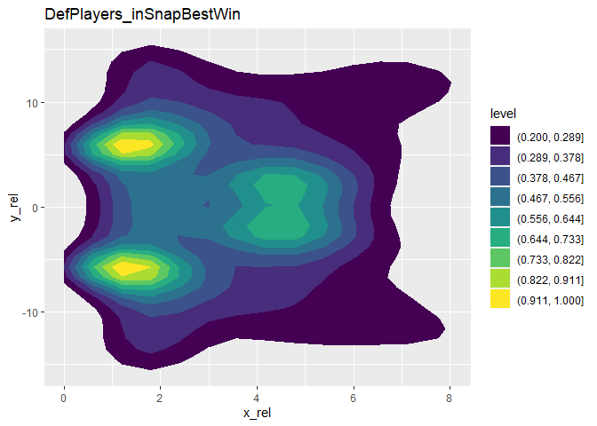<!-- -->

``` r
##### У нас получилось учесть всех защитников для обоих команд


##### DIFFERENT TYPES OF OFFENSE #######################################################
### разные типы атак
attackTypes <- dbGetQuery(con, "SELECT offenseFormation, COUNT(DISTINCT(playId)) as popularity FROM plays
                                GROUP BY offenseFormation ORDER BY popularity DESC")
attackTypes
```

    ##   offenseFormation popularity
    ## 1          SHOTGUN       4320
    ## 2       SINGLEBACK       1949
    ## 3            EMPTY       1857
    ## 4           I_FORM        802
    ## 5           PISTOL        246
    ## 6                         138
    ## 7            JUMBO         51
    ## 8          WILDCAT         36

``` r
# I_FORM
def_ag_I_FORM <- dbGetQuery(con, "SELECT fS.epa, abs(w.x - x_b) as x_rel, (w.y - y_b) as y_rel, w.displayName, w.playId,
                                  w.gameId, w.team, w.playDirection, fS.success  FROM football_inSnap1 as fS JOIN allWeeks as w ON fS.gameId = w.gameId
                                  AND fS.playId = w.playId WHERE w.event = 'ball_snap' AND w.team NOT IN(fS.possessionTeam, 'football')
                                  AND fS.offenseFormation = 'I_FORM'")
plots <- relGraphs(def_ag_I_FORM, "def_ag_I_FORM_Best", "def_ag_I_FORM_Win","def_ag_I_FORM_BestWin")
plots[[3]]
```

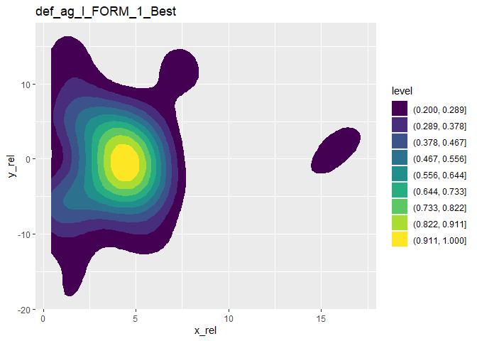<!-- -->

``` r
# SINGLEBACK
def_ag_SINGLEBACK <- dbGetQuery(con, "SELECT fS.epa, abs(w.x - x_b) as x_rel, (w.y - y_b) as y_rel, w.displayName, w.playId,
                                  w.gameId, w.team, w.playDirection, fS.success FROM football_inSnap1 as fS JOIN allWeeks as w ON fS.gameId = w.gameId
                                  AND fS.playId = w.playId WHERE w.event = 'ball_snap' AND w.team NOT IN(fS.possessionTeam, 'football')
                                  AND fS.offenseFormation = 'SINGLEBACK'")
plots <- relGraphs(def_ag_SINGLEBACK, "def_ag_SINGLEBACK_Best", "def_ag_SINGLEBACK_Win","def_ag_SINGLEBACK_BestWin")
plots[[3]]
```

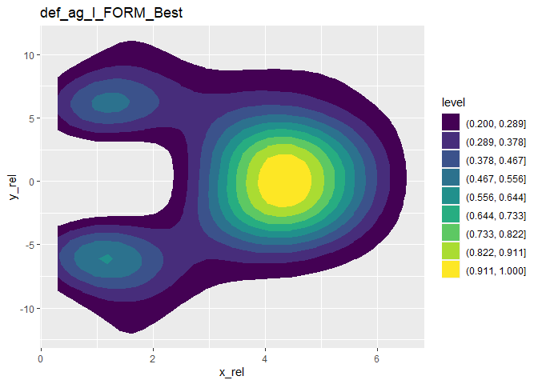<!-- -->

``` r
# SHOTGUN
def_ag_SHOTGUN <- dbGetQuery(con, "SELECT fS.epa, abs(w.x - x_b) as x_rel, (w.y - y_b) as y_rel, w.displayName, w.playId,
                                  w.gameId, w.team, w.playDirection, fS.success FROM football_inSnap1 as fS JOIN allWeeks as w ON fS.gameId = w.gameId
                                  AND fS.playId = w.playId WHERE w.event = 'ball_snap' AND w.team NOT IN(fS.possessionTeam, 'football')
                                  AND fS.offenseFormation = 'SHOTGUN'")
plots <- relGraphs(def_ag_SHOTGUN, "def_ag_SHOTGUN_Best", "def_ag_SHOTGUN_Win","def_ag_SHOTGUN_BestWin")
plots[[3]]
```

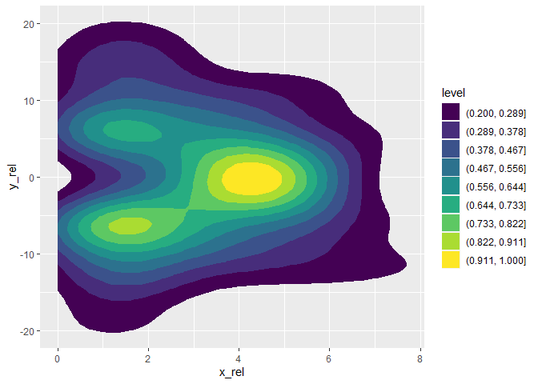<!-- -->

``` r
# PISTOL
def_ag_PISTOL <- dbGetQuery(con, "SELECT fS.epa, abs(w.x - x_b) as x_rel, (w.y - y_b) as y_rel, w.displayName, w.playId,
                                  w.gameId, w.team, w.playDirection, fS.success FROM football_inSnap1 as fS JOIN allWeeks as w ON fS.gameId = w.gameId
                                  AND fS.playId = w.playId WHERE w.event = 'ball_snap' AND w.team NOT IN(fS.possessionTeam, 'football')
                                  AND fS.offenseFormation = 'PISTOL'")
plots <- relGraphs(def_ag_PISTOL, "def_ag_PISTOL_Best", "def_ag_PISTOL_Win","def_ag_PISTOL_BestWin")
plots[[3]]
```

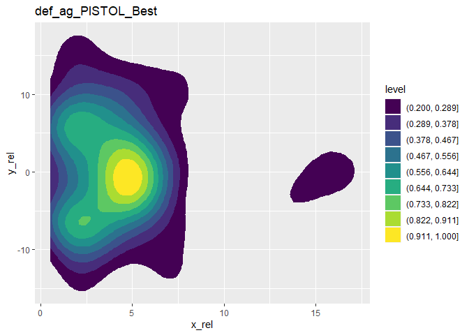<!-- -->

``` r
# WILDCAT 
def_ag_WILDCAT <- dbGetQuery(con, "SELECT fS.epa, abs(w.x - x_b) as x_rel, (w.y - y_b) as y_rel, w.displayName, w.playId,
                                  w.gameId, w.team, w.playDirection, fS.success FROM football_inSnap1 as fS JOIN allWeeks as w ON fS.gameId = w.gameId
                                  AND fS.playId = w.playId WHERE w.event = 'ball_snap' AND w.team NOT IN(fS.possessionTeam, 'football')
                                  AND fS.offenseFormation = 'WILDCAT'")
plots <- relGraphs(def_ag_WILDCAT, "def_ag_WILDCAT_Best", "def_ag_WILDCAT_Win","def_ag_WILDCAT_BestWin")
plots[[3]]
```

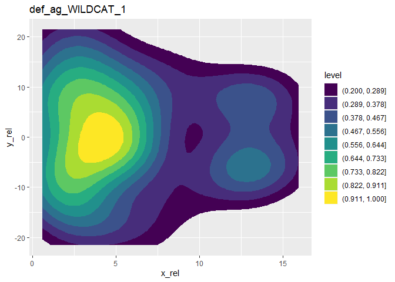<!-- -->

``` r
# JUMBO 
def_ag_JUMBO <- dbGetQuery(con, "SELECT fS.epa, abs(w.x - x_b) as x_rel, (w.y - y_b) as y_rel, w.displayName, w.playId,
                                  w.gameId, w.team, w.playDirection, fS.success FROM football_inSnap1 as fS JOIN allWeeks as w ON fS.gameId = w.gameId
                                  AND fS.playId = w.playId WHERE w.event = 'ball_snap' AND w.team NOT IN(fS.possessionTeam, 'football')
                                  AND fS.offenseFormation = 'JUMBO'")
plots <- relGraphs(def_ag_JUMBO, "def_ag_JUMBO_Best", "def_ag_JUMBO_Win","def_ag_JUMBO_BestWin")
plots[[3]]
```

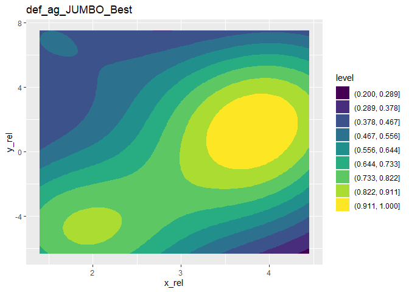<!-- -->

``` r
# EMPTY
def_ag_EMPTY <- dbGetQuery(con, "SELECT fS.epa, abs(w.x - x_b) as x_rel, (w.y - y_b) as y_rel, w.displayName, w.playId,
                                  w.gameId, w.team, w.playDirection, fS.success FROM football_inSnap1 as fS JOIN allWeeks as w ON fS.gameId = w.gameId
                                  AND fS.playId = w.playId WHERE w.event = 'ball_snap' AND w.team NOT IN(fS.possessionTeam, 'football')
                                  AND fS.offenseFormation = 'EMPTY'")
plots <- relGraphs(def_ag_EMPTY, "def_ag_EMPTY_Best", "def_ag_EMPTY_Win","def_ag_EMPTY_BestWin")
plots[[3]]
```

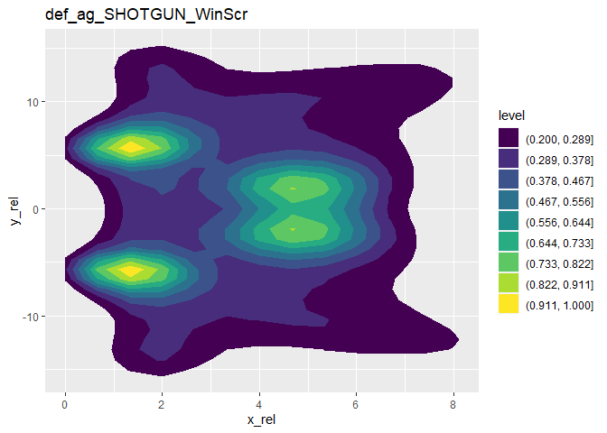<!-- -->

``` r
########################################################################################
##### DIFFERENT TYPES OF YARDLINES #####################################################
### разные по ярдлиниям 
# 0-10
def_yl_0_10 <- dbGetQuery(con, "SELECT fS.epa, abs(w.x - x_b) as x_rel, (w.y - y_b) as y_rel, w.displayName, w.playId,
                                  w.gameId, w.team, w.playDirection, fS.success FROM football_inSnap1 as fS
                                  JOIN allWeeks as w ON fS.gameId = w.gameId
                                  AND fS.playId = w.playId WHERE w.event = 'ball_snap'
                                  AND w.team NOT IN(fS.possessionTeam, 'football')
                                  AND fS.yardlineNumber > 0 AND fS.yardlineNumber <= 10")
plots <- relGraphs(def_yl_0_10, "def_yl_0_10_Best", "def_yl_0_10_Win","def_yl_0_10_BestWin")
plots[[3]]
```

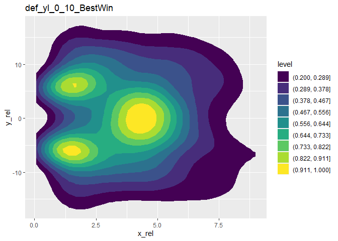<!-- -->

``` r
# 10-20
def_yl_10_20 <- dbGetQuery(con, "SELECT fS.epa, abs(w.x - x_b) as x_rel, (w.y - y_b) as y_rel, w.displayName, w.playId,
                                  w.gameId, w.team, w.playDirection, fS.success FROM football_inSnap1 as fS
                                  JOIN allWeeks as w ON fS.gameId = w.gameId
                                  AND fS.playId = w.playId WHERE w.event = 'ball_snap'
                                  AND w.team NOT IN(fS.possessionTeam, 'football')
                                  AND fS.yardlineNumber > 10 AND fS.yardlineNumber <= 20")
plots <- relGraphs(def_yl_10_20, "def_yl_10_20_Best", "def_yl_10_20_Best","def_yl_10_20_Best")
plots[[3]]
```

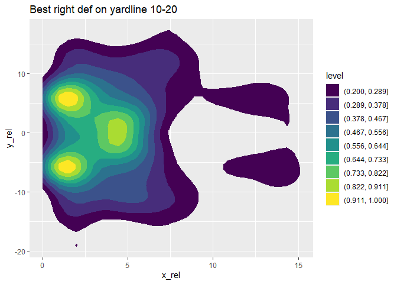<!-- -->

``` r
# 20-35
def_yl_20_35 <- dbGetQuery(con, "SELECT fS.epa, abs(w.x - x_b) as x_rel, (w.y - y_b) as y_rel, w.displayName, w.playId,
                                  w.gameId, w.team, w.playDirection, fS.success FROM football_inSnap1 as fS
                                  JOIN allWeeks as w ON fS.gameId = w.gameId
                                  AND fS.playId = w.playId WHERE w.event = 'ball_snap'
                                  AND w.team NOT IN(fS.possessionTeam, 'football')
                                  AND fS.yardlineNumber > 20 AND fS.yardlineNumber <= 35")
plots <- relGraphs(def_yl_20_35, "def_yl_20_35_Best", "def_yl_20_35_Best","def_yl_20_35_Best")
plots[[3]]
```

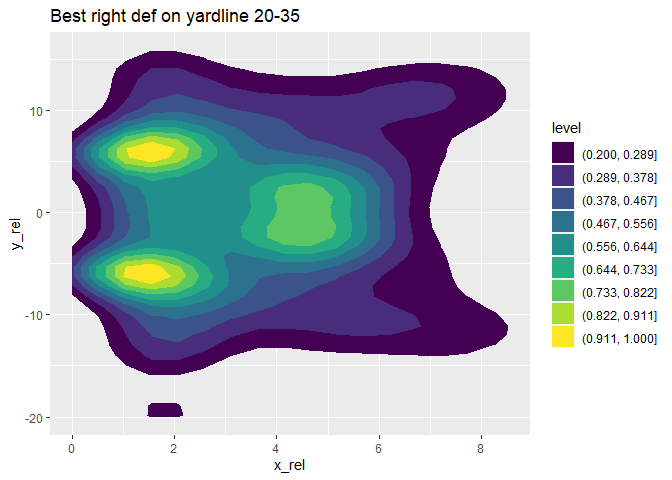<!-- -->

``` r
# 35-50
def_yl_35_50 <- dbGetQuery(con, "SELECT fS.epa, abs(w.x - x_b) as x_rel, (w.y - y_b) as y_rel, w.displayName, w.playId,
                                  w.gameId, w.team, w.playDirection, fS.success FROM football_inSnap1 as fS
                                  JOIN allWeeks as w ON fS.gameId = w.gameId
                                  AND fS.playId = w.playId WHERE w.event = 'ball_snap'
                                  AND w.team NOT IN(fS.possessionTeam, 'football')
                                  AND fS.yardlineNumber > 35 AND fS.yardlineNumber <= 50")
plots <- relGraphs(def_yl_35_50, "def_yl_35_50_Best", "def_yl_35_50_Best","def_yl_35_50_Best")
plots[[3]]
```

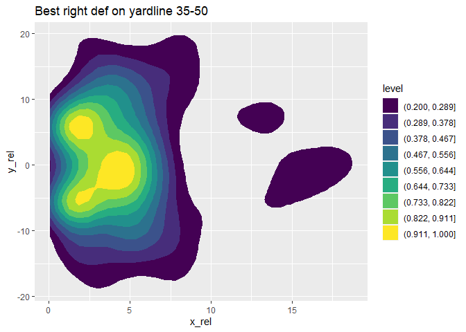<!-- -->

``` r
####################################################################################
##### DIFFERENT TYPES OF ролям #####################################################
### разные по ролям ####### UNIVERSAL
roleTypes <- dbGetQuery(con, "SELECT position, COUNT(DISTINCT(playId)) as popularity FROM allWeeks
                                GROUP BY position ORDER BY popularity DESC")
roleTypes
```

    ##    position popularity
    ## 1        QB       4592
    ## 2                 4592
    ## 3        WR       4590
    ## 4        CB       4590
    ## 5        TE       4577
    ## 6        RB       4561
    ## 7       OLB       4444
    ## 8        FS       4371
    ## 9        SS       4271
    ## 10      ILB       3948
    ## 11       LB       3608
    ## 12      MLB       3309
    ## 13       DB       3058
    ## 14        S       1367
    ## 15       HB        590
    ## 16       FB        580
    ## 17       DE        137
    ## 18       DL         37
    ## 19       DT         23
    ## 20        P         16
    ## 21       LS         16
    ## 22       NT          5
    ## 23        K          5

``` r
for (i in 1:(nrow(roleTypes))) {
  strType <- roleTypes[i,1]
  i_def_pos <- dbGetQuery(con, paste0("SELECT fS.epa, abs(w.x - x_b) as x_rel, (w.y - y_b) as y_rel, w.displayName, w.playId,
                                      w.gameId, w.team, fS.success, w.position FROM football_inSnap1 as fS
                                      JOIN allWeeks as w ON fS.gameId = w.gameId AND fS.playId = w.playId
                                      WHERE w.event = 'ball_snap' AND w.team NOT IN(fS.possessionTeam, 'football')
                                      AND w.position = '", strType, "'"))
  plots <- relGraphs(i_def_pos, paste0(strType, "_def_posBest"),
                     paste0(strType, "_def_posWin"), paste0(strType, "_def_posBestWin"))
  print(plots[[3]])
}
```

    ## [1] x_rel y_rel
    ## <0 rows> (or 0-length row.names)
    ## [1] x_rel y_rel
    ## <0 rows> (or 0-length row.names)

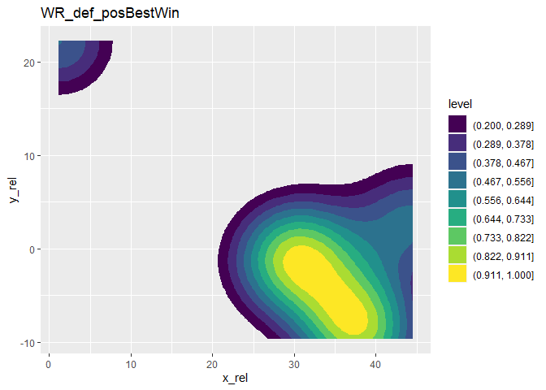<!-- -->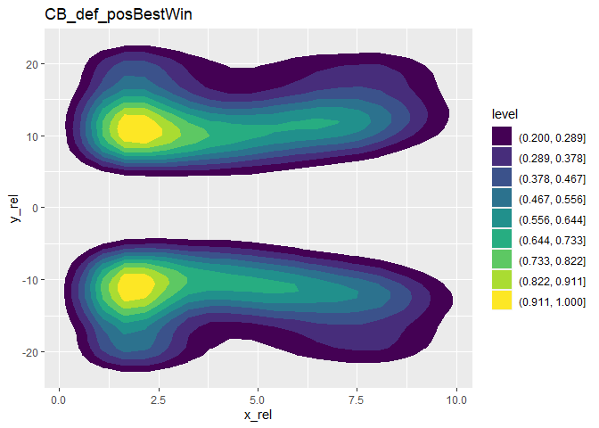<!-- -->

    ##   x_rel y_rel
    ## 1 59.05  5.14

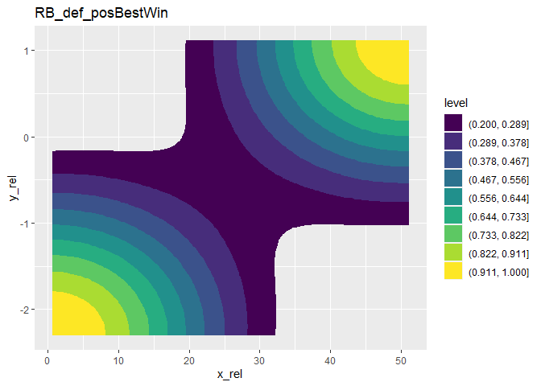<!-- -->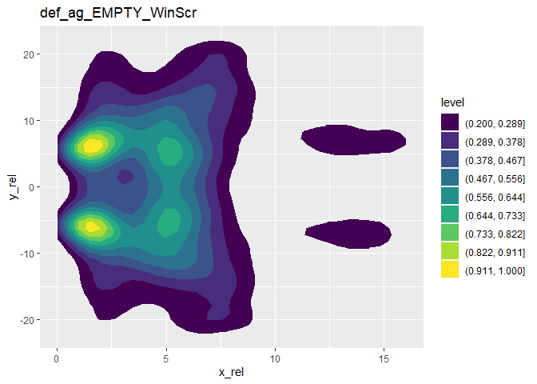<!-- -->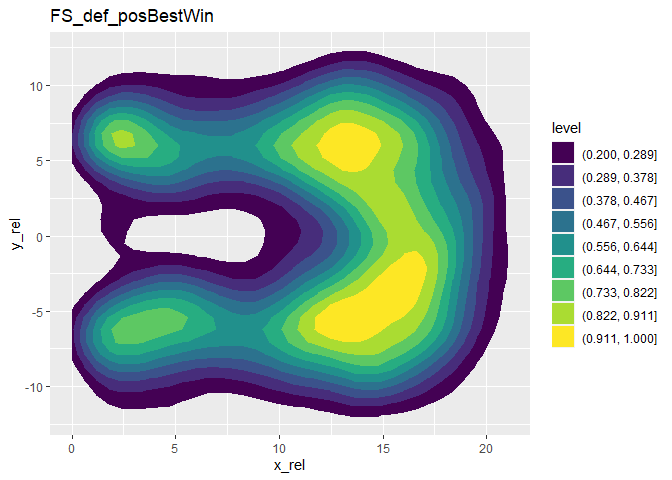<!-- -->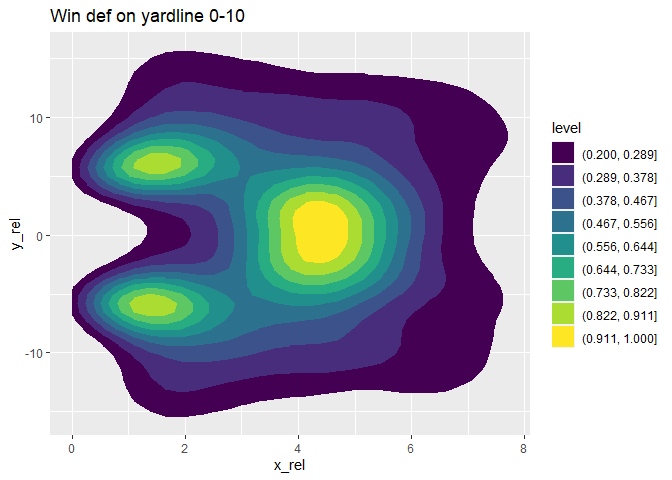<!-- -->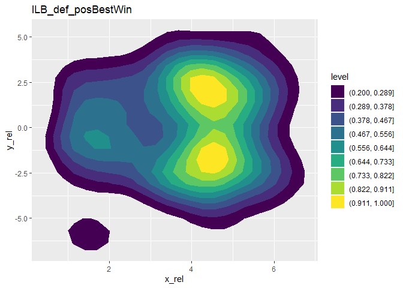<!-- -->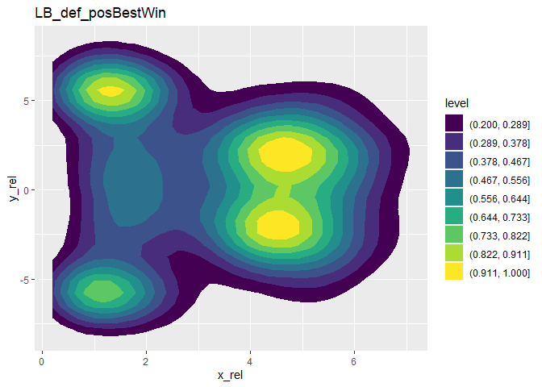<!-- -->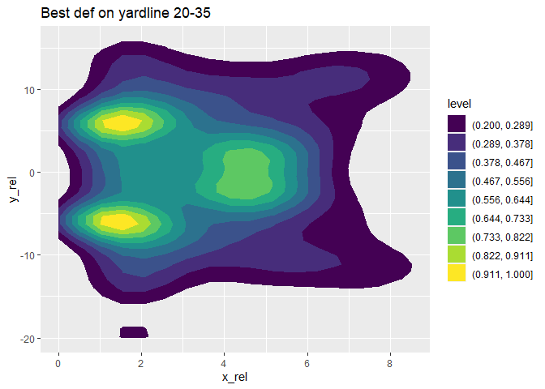<!-- -->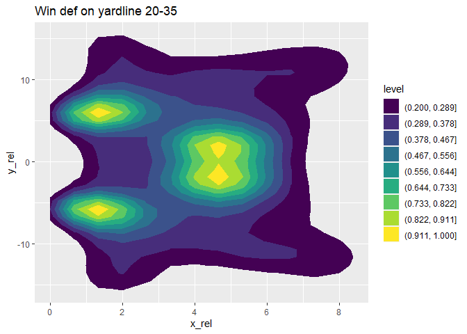<!-- -->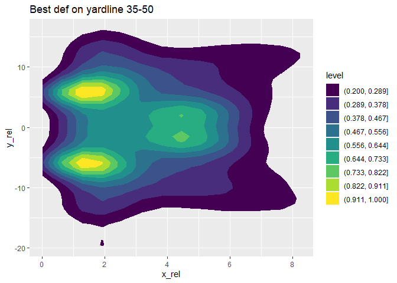<!-- -->

    ## [1] x_rel y_rel
    ## <0 rows> (or 0-length row.names)
    ## [1] x_rel y_rel
    ## <0 rows> (or 0-length row.names)

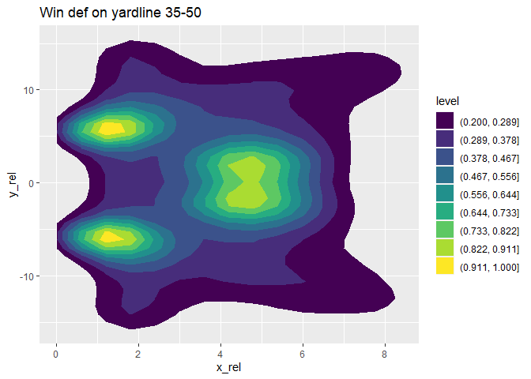<!-- -->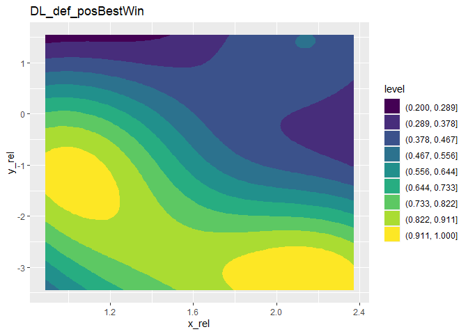<!-- --><!-- -->

    ## [1] x_rel y_rel
    ## <0 rows> (or 0-length row.names)
    ## [1] x_rel y_rel
    ## <0 rows> (or 0-length row.names)
    ##   x_rel y_rel
    ## 5  1.05 -3.04
    ## [1] x_rel y_rel
    ## <0 rows> (or 0-length row.names)

``` r
##### DETECT POP TACTICS
attackTypes <- dbGetQuery(con, "SELECT offenseFormation, COUNT(DISTINCT(playId)) as popularity FROM plays
                                GROUP BY offenseFormation ORDER BY popularity DESC")
attackTypes
```

    ##   offenseFormation popularity
    ## 1          SHOTGUN       4320
    ## 2       SINGLEBACK       1949
    ## 3            EMPTY       1857
    ## 4           I_FORM        802
    ## 5           PISTOL        246
    ## 6                         138
    ## 7            JUMBO         51
    ## 8          WILDCAT         36

``` r
####################################################################################
##### DIFFERENT TYPES OF ROLES and offense tactics #################################
### разные по ролям ####### TACTIC Relative


for (i in 1:(nrow(attackTypes))) {
  strAType <- attackTypes[i,1]
  for (j in 1:(nrow(roleTypes))) {
    strType <- roleTypes[j,1]
    i_def_pos <- dbGetQuery(con, paste0("SELECT fS.epa, abs(w.x - x_b) as x_rel, (w.y - y_b) as y_rel, w.displayName, w.playId,
                                        w.gameId, w.team, fS.success, w.position FROM football_inSnap1 as fS
                                        JOIN allWeeks as w ON fS.gameId = w.gameId AND fS.playId = w.playId
                                        WHERE w.event = 'ball_snap' AND w.team NOT IN(fS.possessionTeam, 'football')
                                        AND w.position = '", strType, "'", "AND fS.offenseFormation = '", strAType, "'"))
    plots <- relGraphs(i_def_pos, paste0(strAType, "_", strType, "_def_posBest"),
                       paste0(strAType, "_", strType, "_def_posWin"), paste0(strAType, "_", strType, "_def_posBestWin"))
    print(plots[[3]])
  }
}
```

    ## [1] x_rel y_rel
    ## <0 rows> (or 0-length row.names)
    ## [1] x_rel y_rel
    ## <0 rows> (or 0-length row.names)

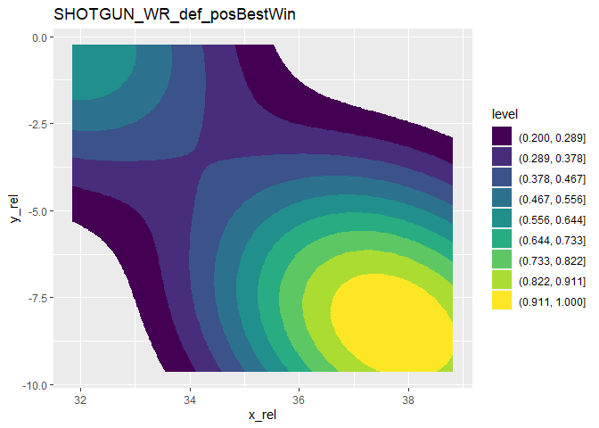<!-- -->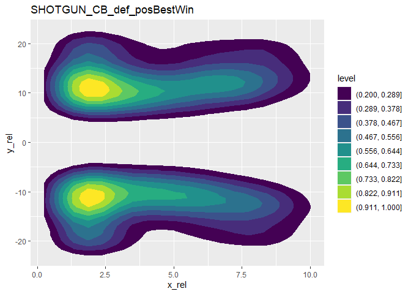<!-- -->

    ##   x_rel y_rel
    ## 1 59.05  5.14
    ## [1] x_rel y_rel
    ## <0 rows> (or 0-length row.names)

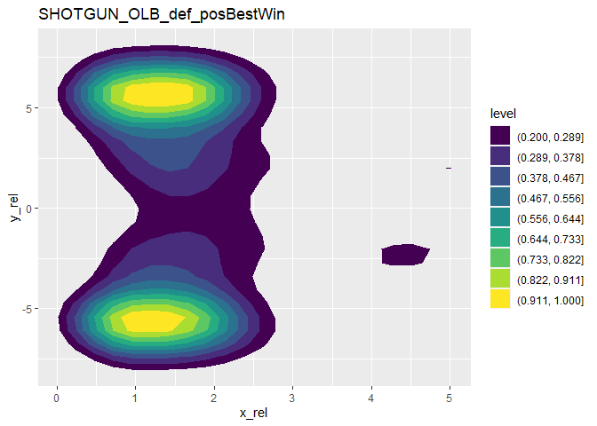<!-- --><!-- -->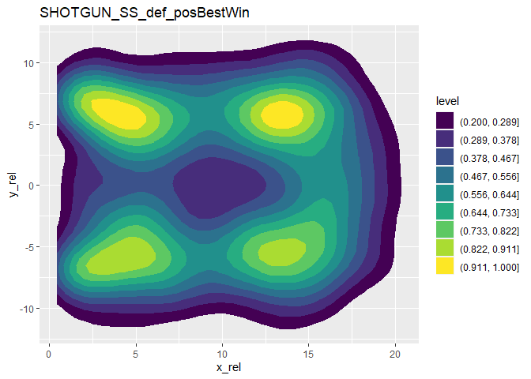<!-- --><!-- -->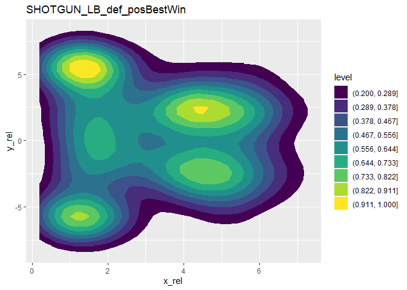<!-- -->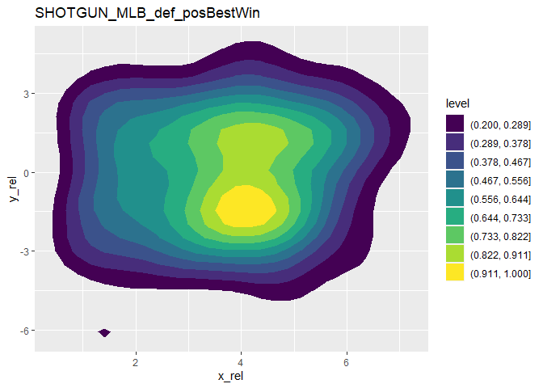<!-- -->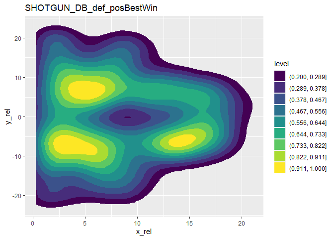<!-- -->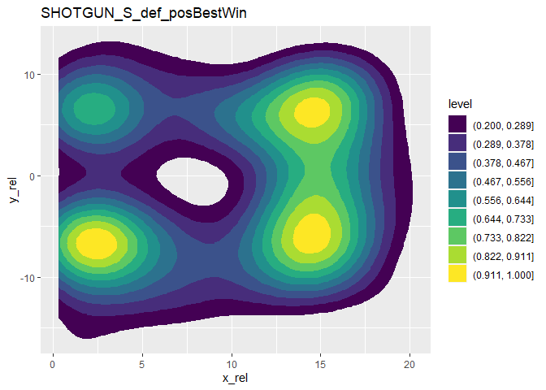<!-- -->

    ## [1] x_rel y_rel
    ## <0 rows> (or 0-length row.names)
    ## [1] x_rel y_rel
    ## <0 rows> (or 0-length row.names)

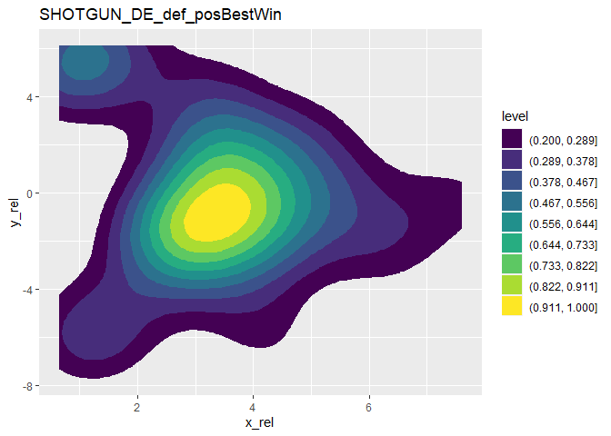<!-- -->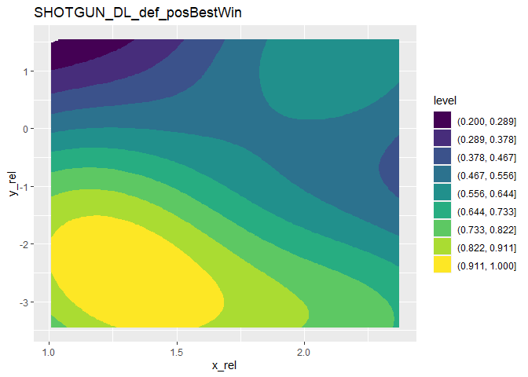<!-- -->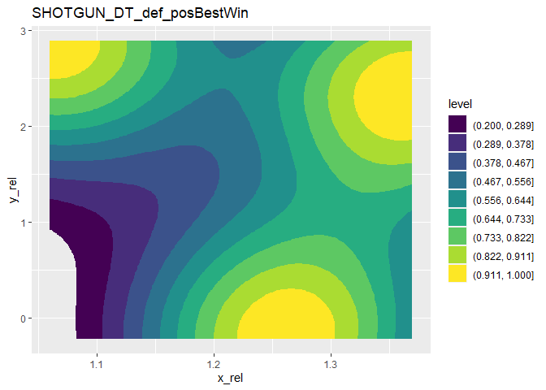<!-- -->

    ## [1] x_rel y_rel
    ## <0 rows> (or 0-length row.names)
    ## [1] x_rel y_rel
    ## <0 rows> (or 0-length row.names)
    ##   x_rel y_rel
    ## 2  1.05 -3.04
    ## [1] x_rel y_rel
    ## <0 rows> (or 0-length row.names)
    ## [1] x_rel y_rel
    ## <0 rows> (or 0-length row.names)
    ## [1] x_rel y_rel
    ## <0 rows> (or 0-length row.names)
    ## [1] x_rel y_rel
    ## <0 rows> (or 0-length row.names)

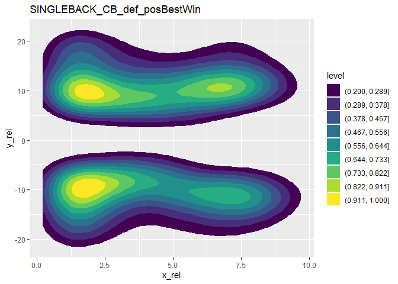<!-- -->

    ## [1] x_rel y_rel
    ## <0 rows> (or 0-length row.names)
    ## [1] x_rel y_rel
    ## <0 rows> (or 0-length row.names)

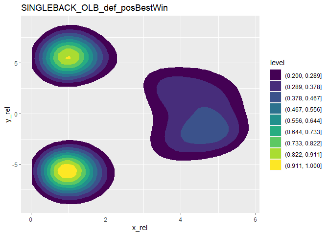<!-- -->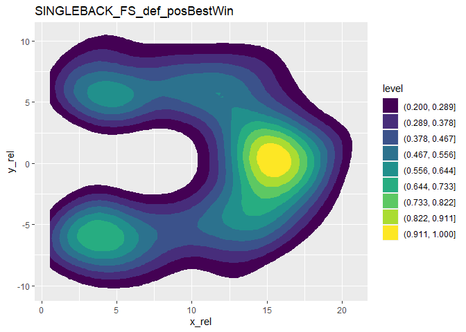<!-- -->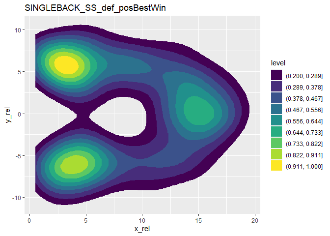<!-- -->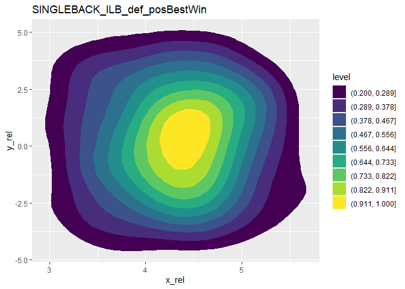<!-- -->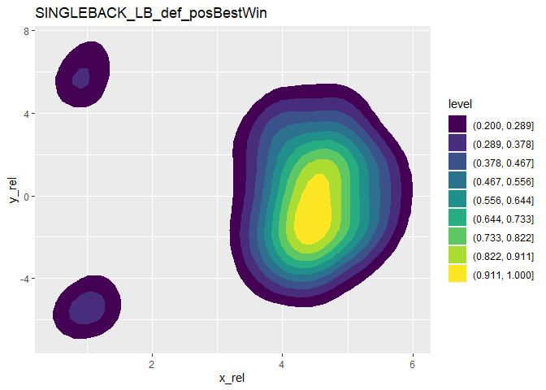<!-- -->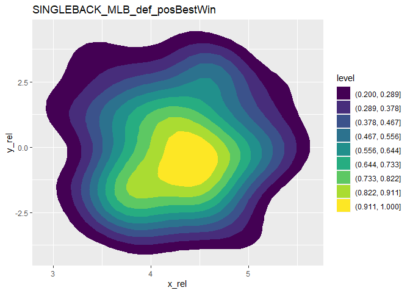<!-- -->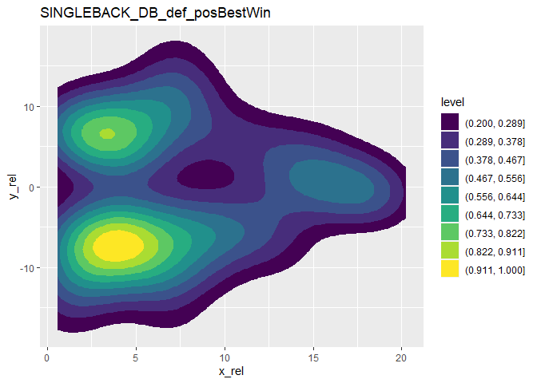<!-- -->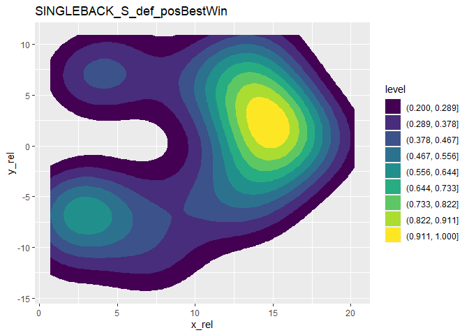<!-- -->

    ## [1] x_rel y_rel
    ## <0 rows> (or 0-length row.names)
    ## [1] x_rel y_rel
    ## <0 rows> (or 0-length row.names)

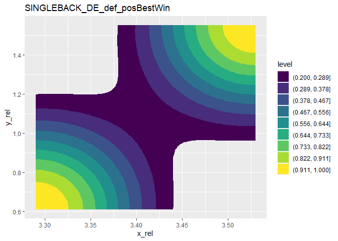<!-- -->

    ##   x_rel y_rel
    ## 2  1.16 -0.59
    ## [1] x_rel y_rel
    ## <0 rows> (or 0-length row.names)
    ## [1] x_rel y_rel
    ## <0 rows> (or 0-length row.names)
    ## [1] x_rel y_rel
    ## <0 rows> (or 0-length row.names)
    ## [1] x_rel y_rel
    ## <0 rows> (or 0-length row.names)
    ## [1] x_rel y_rel
    ## <0 rows> (or 0-length row.names)
    ## [1] x_rel y_rel
    ## <0 rows> (or 0-length row.names)
    ## [1] x_rel y_rel
    ## <0 rows> (or 0-length row.names)
    ## [1] x_rel y_rel
    ## <0 rows> (or 0-length row.names)

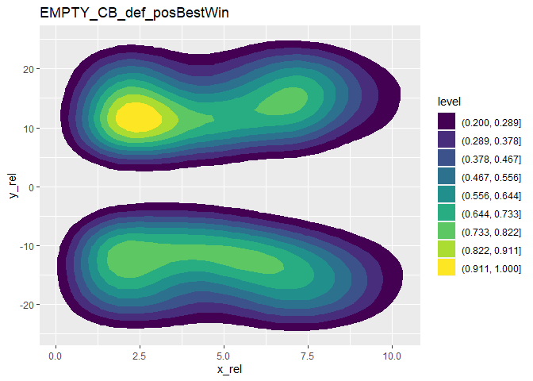<!-- -->

    ## [1] x_rel y_rel
    ## <0 rows> (or 0-length row.names)
    ## [1] x_rel y_rel
    ## <0 rows> (or 0-length row.names)

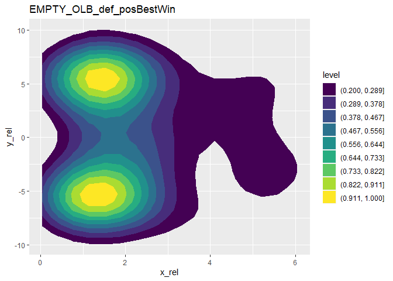<!-- -->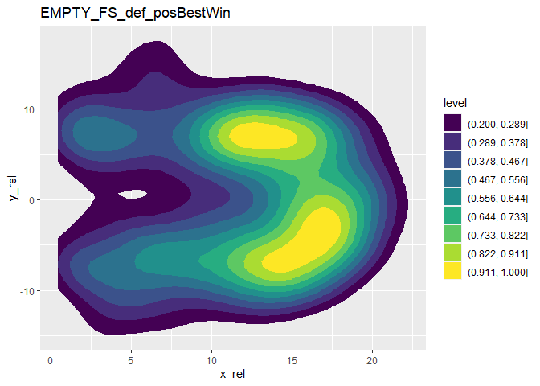<!-- -->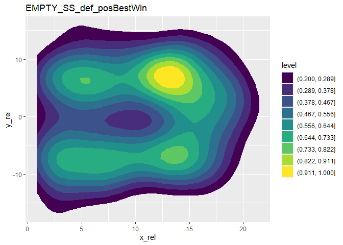<!-- --><!-- --><!-- --><!-- --><!-- --><!-- -->

    ## [1] x_rel y_rel
    ## <0 rows> (or 0-length row.names)
    ## [1] x_rel y_rel
    ## <0 rows> (or 0-length row.names)

<!-- -->

    ##   x_rel y_rel
    ## 3  0.89 -0.49
    ## [1] x_rel y_rel
    ## <0 rows> (or 0-length row.names)
    ## [1] x_rel y_rel
    ## <0 rows> (or 0-length row.names)
    ## [1] x_rel y_rel
    ## <0 rows> (or 0-length row.names)
    ## [1] x_rel y_rel
    ## <0 rows> (or 0-length row.names)
    ## [1] x_rel y_rel
    ## <0 rows> (or 0-length row.names)
    ## [1] x_rel y_rel
    ## <0 rows> (or 0-length row.names)
    ## [1] x_rel y_rel
    ## <0 rows> (or 0-length row.names)
    ## [1] x_rel y_rel
    ## <0 rows> (or 0-length row.names)

<!-- -->

    ## [1] x_rel y_rel
    ## <0 rows> (or 0-length row.names)
    ## [1] x_rel y_rel
    ## <0 rows> (or 0-length row.names)

<!-- --><!-- --><!-- --><!-- --><!-- --><!-- --><!-- --><!-- -->

    ## [1] x_rel y_rel
    ## <0 rows> (or 0-length row.names)
    ## [1] x_rel y_rel
    ## <0 rows> (or 0-length row.names)

<!-- -->

    ## [1] x_rel y_rel
    ## <0 rows> (or 0-length row.names)
    ## [1] x_rel y_rel
    ## <0 rows> (or 0-length row.names)
    ## [1] x_rel y_rel
    ## <0 rows> (or 0-length row.names)
    ## [1] x_rel y_rel
    ## <0 rows> (or 0-length row.names)
    ## [1] x_rel y_rel
    ## <0 rows> (or 0-length row.names)
    ## [1] x_rel y_rel
    ## <0 rows> (or 0-length row.names)
    ## [1] x_rel y_rel
    ## <0 rows> (or 0-length row.names)
    ## [1] x_rel y_rel
    ## <0 rows> (or 0-length row.names)
    ## [1] x_rel y_rel
    ## <0 rows> (or 0-length row.names)

<!-- -->

    ## [1] x_rel y_rel
    ## <0 rows> (or 0-length row.names)
    ## [1] x_rel y_rel
    ## <0 rows> (or 0-length row.names)

<!-- --><!-- --><!-- --><!-- --><!-- --><!-- --><!-- --><!-- -->

    ## [1] x_rel y_rel
    ## <0 rows> (or 0-length row.names)
    ## [1] x_rel y_rel
    ## <0 rows> (or 0-length row.names)
    ## [1] x_rel y_rel
    ## <0 rows> (or 0-length row.names)
    ## [1] x_rel y_rel
    ## <0 rows> (or 0-length row.names)
    ## [1] x_rel y_rel
    ## <0 rows> (or 0-length row.names)
    ## [1] x_rel y_rel
    ## <0 rows> (or 0-length row.names)
    ## [1] x_rel y_rel
    ## <0 rows> (or 0-length row.names)
    ## [1] x_rel y_rel
    ## <0 rows> (or 0-length row.names)
    ## [1] x_rel y_rel
    ## <0 rows> (or 0-length row.names)
    ## [1] x_rel y_rel
    ## <0 rows> (or 0-length row.names)
    ## [1] x_rel y_rel
    ## <0 rows> (or 0-length row.names)

<!-- --><!-- -->

    ## [1] x_rel y_rel
    ## <0 rows> (or 0-length row.names)

<!-- --><!-- --><!-- --><!-- --><!-- --><!-- --><!-- --><!-- --><!-- -->

    ## [1] x_rel y_rel
    ## <0 rows> (or 0-length row.names)
    ## [1] x_rel y_rel
    ## <0 rows> (or 0-length row.names)
    ## [1] x_rel y_rel
    ## <0 rows> (or 0-length row.names)
    ## [1] x_rel y_rel
    ## <0 rows> (or 0-length row.names)
    ## [1] x_rel y_rel
    ## <0 rows> (or 0-length row.names)
    ## [1] x_rel y_rel
    ## <0 rows> (or 0-length row.names)
    ## [1] x_rel y_rel
    ## <0 rows> (or 0-length row.names)
    ## [1] x_rel y_rel
    ## <0 rows> (or 0-length row.names)
    ## [1] x_rel y_rel
    ## <0 rows> (or 0-length row.names)
    ## [1] x_rel y_rel
    ## <0 rows> (or 0-length row.names)
    ## [1] x_rel y_rel
    ## <0 rows> (or 0-length row.names)
    ## [1] x_rel y_rel
    ## <0 rows> (or 0-length row.names)

<!-- -->

    ## [1] x_rel y_rel
    ## <0 rows> (or 0-length row.names)
    ## [1] x_rel y_rel
    ## <0 rows> (or 0-length row.names)

<!-- --><!-- --><!-- --><!-- --><!-- --><!-- --><!-- -->

    ##   x_rel y_rel
    ## 1  6.28  4.61
    ## [1] x_rel y_rel
    ## <0 rows> (or 0-length row.names)
    ## [1] x_rel y_rel
    ## <0 rows> (or 0-length row.names)
    ##   x_rel y_rel
    ## 1  4.27 -0.63
    ## [1] x_rel y_rel
    ## <0 rows> (or 0-length row.names)
    ## [1] x_rel y_rel
    ## <0 rows> (or 0-length row.names)
    ## [1] x_rel y_rel
    ## <0 rows> (or 0-length row.names)
    ## [1] x_rel y_rel
    ## <0 rows> (or 0-length row.names)
    ## [1] x_rel y_rel
    ## <0 rows> (or 0-length row.names)
    ## [1] x_rel y_rel
    ## <0 rows> (or 0-length row.names)
    ## [1] x_rel y_rel
    ## <0 rows> (or 0-length row.names)
    ## [1] x_rel y_rel
    ## <0 rows> (or 0-length row.names)
    ## [1] x_rel y_rel
    ## <0 rows> (or 0-length row.names)

<!-- -->

    ## [1] x_rel y_rel
    ## <0 rows> (or 0-length row.names)
    ## [1] x_rel y_rel
    ## <0 rows> (or 0-length row.names)

<!-- --><!-- --><!-- --><!-- --><!-- --><!-- --><!-- -->

    ## [1] x_rel y_rel
    ## <0 rows> (or 0-length row.names)
    ## [1] x_rel y_rel
    ## <0 rows> (or 0-length row.names)
    ## [1] x_rel y_rel
    ## <0 rows> (or 0-length row.names)
    ## [1] x_rel y_rel
    ## <0 rows> (or 0-length row.names)
    ## [1] x_rel y_rel
    ## <0 rows> (or 0-length row.names)
    ## [1] x_rel y_rel
    ## <0 rows> (or 0-length row.names)
    ## [1] x_rel y_rel
    ## <0 rows> (or 0-length row.names)
    ## [1] x_rel y_rel
    ## <0 rows> (or 0-length row.names)
    ## [1] x_rel y_rel
    ## <0 rows> (or 0-length row.names)
    ## [1] x_rel y_rel
    ## <0 rows> (or 0-length row.names)

``` r
### То что некоторые пустые это нормально, ролей много, некоторые тактики и роли непопулярны


###### Популярные тактики по ярдлиниям c учетом на чьей стороне поля!

# сравнить Worst
# сделать по play Result, сравнить #Done

# Pending2 для разных типов игроков!!! можно для разных типов атак просто выяснить


# end

dbDisconnect(con)
```
