filtered\_heatmapping
================
yurkovkirill
05 01 2021

\#Setup

``` r
library(DBI)
library(ggplot2)
library(dplyr)
```

    ## 
    ## Attaching package: 'dplyr'

    ## The following objects are masked from 'package:stats':
    ## 
    ##     filter, lag

    ## The following objects are masked from 'package:base':
    ## 
    ##     intersect, setdiff, setequal, union

``` r
library(MASS)
```

    ## 
    ## Attaching package: 'MASS'

    ## The following object is masked from 'package:dplyr':
    ## 
    ##     select

``` r
library(raster)
```

    ## Loading required package: sp

    ## 
    ## Attaching package: 'raster'

    ## The following objects are masked from 'package:MASS':
    ## 
    ##     area, select

    ## The following object is masked from 'package:dplyr':
    ## 
    ##     select

``` r
library(viridis)
```

    ## Loading required package: viridisLite

``` r
library("factoextra")
```

    ## Welcome! Want to learn more? See two factoextra-related books at https://goo.gl/ve3WBa

``` r
knitr::opts_knit$set(root.dir = "D:/MyFilesDesktop/Student/7SEM/DataScience/DS_Project")
```

\#Filling DataBase BEGIN

``` r
con <- dbConnect(RSQLite::SQLite(), ":memory:")
#dbListTables(con)
#options(max.print=10000)

dbWriteTable(con, "games", read.csv("data/games.csv"))
dbWriteTable(con, "allWeeks", read.csv("data/week1.csv"))
dbListFields(con, "allWeeks")
```

    ##  [1] "time"          "x"             "y"             "s"            
    ##  [5] "a"             "dis"           "o"             "dir"          
    ##  [9] "event"         "nflId"         "displayName"   "jerseyNumber" 
    ## [13] "position"      "frameId"       "team"          "gameId"       
    ## [17] "playId"        "playDirection" "route"

``` r
dbAppendTable(con, "allWeeks", read.csv("data/week2.csv"))
```

    ## [1] 1231793

``` r
dbAppendTable(con, "allWeeks", read.csv("data/week3.csv"))
```

    ## [1] 1168345

``` r
dbAppendTable(con, "allWeeks", read.csv("data/week4.csv"))
```

    ## [1] 1205527

``` r
dbAppendTable(con, "allWeeks", read.csv("data/week5.csv"))
```

    ## [1] 1171908

``` r
dbAppendTable(con, "allWeeks", read.csv("data/week6.csv"))
```

    ## [1] 1072563

``` r
dbAppendTable(con, "allWeeks", read.csv("data/week7.csv"))
```

    ## [1] 982583

``` r
dbAppendTable(con, "allWeeks", read.csv("data/week8.csv"))
```

    ## [1] 1001501

``` r
dbAppendTable(con, "allWeeks", read.csv("data/week9.csv"))
```

    ## [1] 958464

``` r
dbAppendTable(con, "allWeeks", read.csv("data/week10.csv"))
```

    ## [1] 964889

``` r
dbAppendTable(con, "allWeeks", read.csv("data/week11.csv"))
```

    ## [1] 932240

``` r
dbAppendTable(con, "allWeeks", read.csv("data/week12.csv"))
```

    ## [1] 1024868

``` r
dbAppendTable(con, "allWeeks", read.csv("data/week13.csv"))
```

    ## [1] 1172517

``` r
dbAppendTable(con, "allWeeks", read.csv("data/week14.csv"))
```

    ## [1] 1161644

``` r
dbAppendTable(con, "allWeeks", read.csv("data/week15.csv"))
```

    ## [1] 1081222

``` r
dbAppendTable(con, "allWeeks", read.csv("data/week16.csv"))
```

    ## [1] 1144037

``` r
dbAppendTable(con, "allWeeks", read.csv("data/week17.csv"))
```

    ## [1] 1049265

``` r
dbGetQuery(con, "SELECT COUNT(*) FROM allWeeks")
```

    ##   COUNT(*)
    ## 1 18309388

``` r
# Add additional column for statistic:
# - success
# - yardFromDefTouch
plays <- read.csv("data/plays.csv")
plays$success <- 0
plays$success[plays$playResult >= plays$yardsToGo] <- 1
plays$yardFromDefTouch <- 0
dbWriteTable(con, "plays", plays)
dbExecute(con, "UPDATE plays SET yardFromDefTouch = CASE 
                WHEN (possessionTeam = yardlineSide) THEN (100 - yardlineNumber) 
                ELSE yardlineNumber
                END")
```

    ## [1] 19239

``` r
dbListTables(con)
```

    ## [1] "allWeeks" "games"    "plays"

``` r
#dbRemoveTable(con, "games")
#dbRemoveTable(con, "plays")
#dbRemoveTable(con, "allWeeks")
```

Осмотр данных

``` r
testTeam <- head(dbGetQuery(con, "SELECT DISTINCT w.nflId, w.team FROM plays as p JOIN allWeeks as w ON p.gameId = w.gameId
                                      AND p.playId = w.playId WHERE w.gameId = 2018090600
                                      ORDER BY w.nflId"),12)#w.event = 'ball_snap'")
testTeam
```

    ##      nflId     team
    ## 1       NA football
    ## 2      310     away
    ## 3    79848     home
    ## 4  2495454     away
    ## 5  2495613     home
    ## 6  2506467     home
    ## 7  2507763     home
    ## 8  2507828     away
    ## 9  2532842     home
    ## 10 2533040     away
    ## 11 2534832     home
    ## 12 2539291     home

``` r
# этот запрос дал нам понять, что команда у игрока во время игры не меняется, но мы знаем что меняется сторона

testFrames <- head(dbGetQuery(con, "SELECT w.frameId, w.playId, COUNT(w.nflId), COUNT(w.displayName) FROM plays as p JOIN allWeeks as w ON p.gameId = w.gameId
                                      AND p.playId = w.playId WHERE w.gameId = 2018090600
                                      GROUP BY w.frameId, w.playId ORDER BY w.playId"),60)#w.event = 'ball_snap'")
options(max.print=10000)
testFrames
```

    ##    frameId playId COUNT(w.nflId) COUNT(w.displayName)
    ## 1        1     75             13                   14
    ## 2        2     75             13                   14
    ## 3        3     75             13                   14
    ## 4        4     75             13                   14
    ## 5        5     75             13                   14
    ## 6        6     75             13                   14
    ## 7        7     75             13                   14
    ## 8        8     75             13                   14
    ## 9        9     75             13                   14
    ## 10      10     75             13                   14
    ## 11      11     75             13                   14
    ## 12      12     75             13                   14
    ## 13      13     75             13                   14
    ## 14      14     75             13                   14
    ## 15      15     75             13                   14
    ## 16      16     75             13                   14
    ## 17      17     75             13                   14
    ## 18      18     75             13                   14
    ## 19      19     75             13                   14
    ## 20      20     75             13                   14
    ## 21      21     75             13                   14
    ## 22      22     75             13                   14
    ## 23      23     75             13                   14
    ## 24      24     75             13                   14
    ## 25      25     75             13                   14
    ## 26      26     75             13                   14
    ## 27      27     75             13                   14
    ## 28      28     75             13                   14
    ## 29      29     75             13                   14
    ## 30      30     75             13                   14
    ## 31      31     75             13                   14
    ## 32      32     75             13                   14
    ## 33      33     75             13                   14
    ## 34      34     75             13                   14
    ## 35      35     75             13                   14
    ## 36      36     75             13                   14
    ## 37      37     75             13                   14
    ## 38      38     75             13                   14
    ## 39      39     75             13                   14
    ## 40      40     75             13                   14
    ## 41      41     75             13                   14
    ## 42      42     75             13                   14
    ## 43      43     75             13                   14
    ## 44      44     75             13                   14
    ## 45      45     75             13                   14
    ## 46      46     75             13                   14
    ## 47      47     75             13                   14
    ## 48      48     75             13                   14
    ## 49      49     75             13                   14
    ## 50      50     75             13                   14
    ## 51      51     75             13                   14
    ## 52      52     75             13                   14
    ## 53      53     75             13                   14
    ## 54      54     75             13                   14
    ## 55      55     75             13                   14
    ## 56      56     75             13                   14
    ## 57      57     75             13                   14
    ## 58      58     75             13                   14
    ## 59      59     75             13                   14
    ## 60       1    146             13                   14

``` r
# этот запрос показал, что количество игроков каждом фрейме одного момента одинаковое, поэтому смело можно брать
# ball_snap кадр и мы получим данные о всех зафиксированных игроках в моменте
```

Modify play table team column

``` r
################################################################################################################
# Обработка данных
################################################################################################################
##### Нормальный отбор по команде нападения BEGIN
# QUERIES for teams ########################
dbExecute(con, "UPDATE plays as p SET possessionTeam = 'away'
                WHERE possessionTeam != (SELECT homeTeamAbbr FROM games as g WHERE p.gameId = g.gameId)")
```

    ## [1] 9621

``` r
dbExecute(con, "UPDATE plays as p SET possessionTeam = 'home'
                WHERE possessionTeam = (SELECT homeTeamAbbr FROM games as g WHERE p.gameId = g.gameId)")
```

    ## [1] 9618

Check it

``` r
testTeam1 <- dbGetQuery(con, "SELECT team, COUNT(DISTINCT(playId)) FROM allWeeks as w GROUP BY team")
testTeam1
```

    ##       team COUNT(DISTINCT(playId))
    ## 1     away                    4591
    ## 2 football                    4592
    ## 3     home                    4592

``` r
# проверка
testTeamPlay <- dbGetQuery(con, "SELECT possessionTeam, COUNT(DISTINCT(playId)) FROM plays GROUP BY possessionTeam")
testTeamPlay
```

    ##   possessionTeam COUNT(DISTINCT(playId))
    ## 1           away                    3973
    ## 2           home                    3992

New ball snap table

``` r
#######################################################################################################################
# берем информацию по мячу ## MAIN QUERY for init point (ball)
#######################################################################################################################

#dbListFields(con, "plays")
dbWriteTable(con, "football_inSnap1", dbGetQuery(con, "SELECT p.epa, w.x as x_b, w.y as y_b, w.displayName, w.event, w.playId,
                                      w.gameId, p.offenseFormation, p.possessionTeam, p.yardFromDefTouch, p.success
                                      FROM plays as p JOIN allWeeks as w ON p.gameId = w.gameId
                                      AND p.playId = w.playId WHERE w.event = 'ball_snap' AND w.displayName = 'Football'"))
dbListFields(con, "football_inSnap1")
```

    ##  [1] "epa"              "x_b"              "y_b"              "displayName"     
    ##  [5] "event"            "playId"           "gameId"           "offenseFormation"
    ##  [9] "possessionTeam"   "yardFromDefTouch" "success"

``` r
#dbRemoveTable(con, "football_inSnap1")
```

# Filling DataBase END

# Функции построения базовых heatmaps и базовой выборки

``` r
# Для защиты
relGraphs <- function(df, strBest, strWin, strBestWin){
  summary(df)
  dfBest <- df[df$epa < summary(df$epa)[[2]],]
  dfWin <- df[df$success == 0,]
  dfBestWin <- df[df$epa < summary(df$epa)[[2]] & df$success == 0,]
  
  if(nrow(dfBest) > 1){
    dfBestPlot <- dfBest %>% 
      ggplot(aes(x = x_rel, y = y_rel)) +
      geom_density2d_filled(contour_var = "ndensity", breaks = seq(0.2, 1.0, length.out = 10)) + 
      labs(title=strBest)
  } else {
    dfBestPlot <- list(dfBest[,c(2,3)], strBest) 
  }
  
  if(nrow(dfWin) > 1){
    dfWinPlot <- dfWin %>% 
      ggplot(aes(x = x_rel, y = y_rel)) +
      geom_density2d_filled(contour_var = "ndensity", breaks = seq(0.2, 1.0, length.out = 10)) + 
      labs(title=strWin)
  } else {
    dfWinPlot <- list(dfWin[,c(2,3)], strWin)
  }
  
  if(nrow(dfBestWin) > 1){
    dfBestWinPlot <- dfBestWin %>% 
      ggplot(aes(x = x_rel, y = y_rel)) +
      geom_density2d_filled(aes(fill = ..level..),
                            contour_var = "ndensity",
                            breaks = seq(0.2, 1.0, length.out = 10)
                            )
      labs(title=strBestWin)
  } else {
    dfBestWinPlot <- list(dfBestWin[,c(2,3)], strBestWin)
  }

  return (list(dfBestPlot, dfWinPlot, dfBestWinPlot, dfBestWin))
}

# Для атаки
relGraphsAttack <- function(df, strBest, strWin, strBestWin){
  summary(df)
  dfBest <- df[df$epa > summary(df$epa)[[5]],]
  dfWin <- df[df$success == 1,]
  dfBestWin <- df[df$epa > summary(df$epa)[[5]] & df$success == 1,]
  
  if(nrow(dfBest) > 1){
    dfBestPlot <- dfBest %>% 
      ggplot(aes(x = x_rel, y = y_rel)) +
      geom_density2d_filled(contour_var = "ndensity", breaks = seq(0.2, 1.0, length.out = 10)) + 
      labs(title=strBest)
  } else {
    dfBestPlot <- list(dfBest[,c(2,3)], strBest) 
  }
  
  if(nrow(dfWin) > 1){
    dfWinPlot <- dfWin %>% 
      ggplot(aes(x = x_rel, y = y_rel)) +
      geom_density2d_filled(contour_var = "ndensity", breaks = seq(0.2, 1.0, length.out = 10)) + 
      labs(title=strWin)
  } else {
    dfWinPlot <- list(dfWin[,c(2,3)], strWin)
  }
  
  #SBestWin <- summary(dfBestWin)
  #xline <- density(dfBestWin$x_rel)$x[which.max(density(dfBestWin$x_rel)$y)]
  #yline <- density(dfBestWin$y_rel)$x[which.max(density(dfBestWin$y_rel)$y)]
  if(nrow(dfBestWin) > 1){
    dfBestWinPlot <- dfBestWin %>% 
      ggplot(aes(x = x_rel, y = y_rel)) +
      geom_density2d_filled(aes(fill = ..level..),
                            contour_var = "ndensity",
                            breaks = seq(0.2, 1.0, length.out = 10)
      ) + #очистка
      labs(title=strBestWin)
  } else {
    dfBestWinPlot <- list(dfBestWin[,c(2,3)], strBestWin)
  }
  
  return (list(dfBestPlot, dfWinPlot, dfBestWinPlot, dfBestWin))
}
# EXAMPLE: plots <- relGraphs(WR_def_pos, "WR_def_posBest", "WR_def_posWin","WR_def_posBestWin")
# plots
# or plots[[1]]
```

# Проверка изменений данных

``` r
#### теперь пробуем соединить по команде (home / away) ####
# Красота
DefPlayers_inSnap <- dbGetQuery(con, "SELECT fS.epa, abs(w.x - x_b) as x_rel, (w.y - y_b) as y_rel, w.displayName, w.playId,
                                      w.gameId, w.team, w.playDirection, fS.success FROM football_inSnap1 as fS
                                      JOIN allWeeks as w ON fS.gameId = w.gameId AND fS.playId = w.playId
                                      WHERE w.event = 'ball_snap' AND w.team NOT IN(fS.possessionTeam, 'football')")

plots <- relGraphs(DefPlayers_inSnap, "DefPlayers_inSnapBest", "DefPlayers_inSnapWinScr","DefPlayers_inSnapBestWin")
plots[[3]]
```

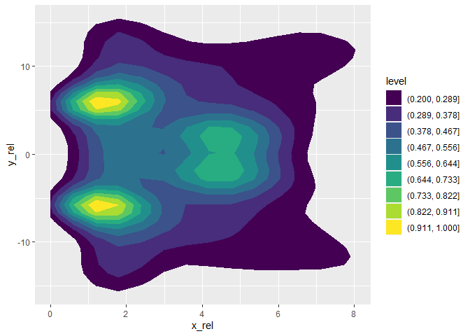<!-- -->

``` r
##### У нас получилось учесть всех защитников для обоих команд
```

# Функция выборки ключевых точек

``` r
extractMultiMaxDensityXYrelCLUST <- function(dataframe){
  rel_max <- data.frame(x=double(),
                        y=double(),
                        density=double())
  #dataframe <- dfBest
  kde <- kde2d(dataframe$x_rel, dataframe$y_rel, n = 100)
  r <- raster(kde)
  dfKde <- as.data.frame(r, xy=T) #layer == density
  xyD <- aggregate(dfKde$layer, by = list(dfKde$x, dfKde$y), FUN = max)
  names(xyD)[names(xyD) == "x"] <- "density"
  names(xyD)[names(xyD) == "Group.1"] <- "x"
  names(xyD)[names(xyD) == "Group.2"] <- "y"
  
  dens60 <- min(xyD$density) + (max(xyD$density) - min(xyD$density)) * 75/100 ## Look
  xyDmax <- xyD[xyD$density > dens60,]
  kmClus <- eclust(xyDmax[,c(1,2)], "kmeans", nstart = nrow(xyDmax), graph = FALSE, nboot = 10)
  
  for(i in unique(kmClus$cluster)){
    clusterized <- subset(cbind(xyDmax, cluster = kmClus$cluster), cluster == i)
    dens90c <- min(clusterized$density) + (max(clusterized$density) - min(clusterized$density)) * 90/100
    clusterized <- subset(clusterized, density > dens90c)
    max_point <- data.frame(x = summary(clusterized$x)[[3]], y = summary(clusterized$y)[[3]], density = 1)
    rel_max <- rbind(rel_max, max_point)
  }
  
  #rel_max <- as.data.frame(kmClus$centers)

  return(rel_max)
}
```

\#Реальное использование BEGIN

# Общие heatmaps лучшего расположения против различных типов атак по их популярности

``` r
##### DIFFERENT TYPES OF OFFENSE #######################################################
### разные типы атак
attackTypes <- dbGetQuery(con, "SELECT offenseFormation, COUNT(DISTINCT(playId)) as popularity FROM plays
                                GROUP BY offenseFormation ORDER BY popularity DESC")
attackTypes
```

    ##   offenseFormation popularity
    ## 1          SHOTGUN       4320
    ## 2       SINGLEBACK       1949
    ## 3            EMPTY       1857
    ## 4           I_FORM        802
    ## 5           PISTOL        246
    ## 6                         138
    ## 7            JUMBO         51
    ## 8          WILDCAT         36

``` r
# I_FORM
def_ag_I_FORM <- dbGetQuery(con, "SELECT fS.epa, abs(w.x - x_b) as x_rel, (w.y - y_b) as y_rel, w.displayName, w.playId,
                                  w.gameId, w.team, w.playDirection, fS.success  FROM football_inSnap1 as fS JOIN allWeeks as w ON fS.gameId = w.gameId
                                  AND fS.playId = w.playId WHERE w.event = 'ball_snap' AND w.team NOT IN(fS.possessionTeam, 'football')
                                  AND fS.offenseFormation = 'I_FORM'")
plots <- relGraphs(def_ag_I_FORM, "def_ag_I_FORM_Best", "def_ag_I_FORM_Win","def_ag_I_FORM_BestWin")
plots[[3]]
```

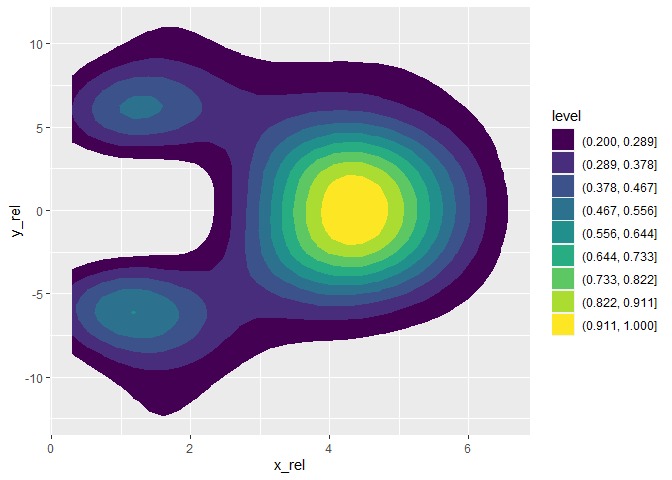<!-- -->

``` r
# SINGLEBACK
def_ag_SINGLEBACK <- dbGetQuery(con, "SELECT fS.epa, abs(w.x - x_b) as x_rel, (w.y - y_b) as y_rel, w.displayName, w.playId,
                                  w.gameId, w.team, w.playDirection, fS.success FROM football_inSnap1 as fS JOIN allWeeks as w ON fS.gameId = w.gameId
                                  AND fS.playId = w.playId WHERE w.event = 'ball_snap' AND w.team NOT IN(fS.possessionTeam, 'football')
                                  AND fS.offenseFormation = 'SINGLEBACK'")
plots <- relGraphs(def_ag_SINGLEBACK, "def_ag_SINGLEBACK_Best", "def_ag_SINGLEBACK_Win","def_ag_SINGLEBACK_BestWin")
plots[[3]]
```

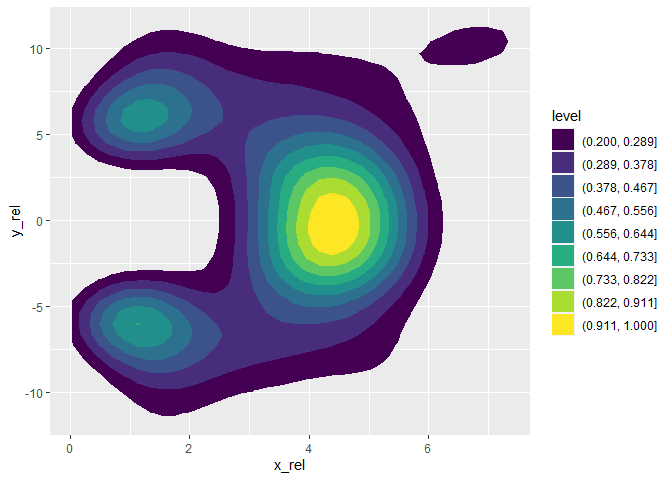<!-- -->

``` r
# SHOTGUN
def_ag_SHOTGUN <- dbGetQuery(con, "SELECT fS.epa, abs(w.x - x_b) as x_rel, (w.y - y_b) as y_rel, w.displayName, w.playId,
                                  w.gameId, w.team, w.playDirection, fS.success FROM football_inSnap1 as fS JOIN allWeeks as w ON fS.gameId = w.gameId
                                  AND fS.playId = w.playId WHERE w.event = 'ball_snap' AND w.team NOT IN(fS.possessionTeam, 'football')
                                  AND fS.offenseFormation = 'SHOTGUN'")
plots <- relGraphs(def_ag_SHOTGUN, "def_ag_SHOTGUN_Best", "def_ag_SHOTGUN_Win","def_ag_SHOTGUN_BestWin")
plots[[3]]
```

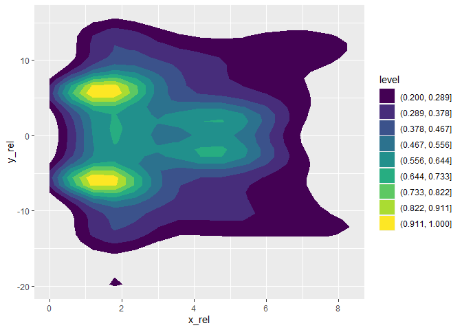<!-- -->

``` r
# PISTOL
def_ag_PISTOL <- dbGetQuery(con, "SELECT fS.epa, abs(w.x - x_b) as x_rel, (w.y - y_b) as y_rel, w.displayName, w.playId,
                                  w.gameId, w.team, w.playDirection, fS.success FROM football_inSnap1 as fS JOIN allWeeks as w ON fS.gameId = w.gameId
                                  AND fS.playId = w.playId WHERE w.event = 'ball_snap' AND w.team NOT IN(fS.possessionTeam, 'football')
                                  AND fS.offenseFormation = 'PISTOL'")
plots <- relGraphs(def_ag_PISTOL, "def_ag_PISTOL_Best", "def_ag_PISTOL_Win","def_ag_PISTOL_BestWin")
plots[[3]]
```

<!-- -->

``` r
# WILDCAT 
def_ag_WILDCAT <- dbGetQuery(con, "SELECT fS.epa, abs(w.x - x_b) as x_rel, (w.y - y_b) as y_rel, w.displayName, w.playId,
                                  w.gameId, w.team, w.playDirection, fS.success FROM football_inSnap1 as fS JOIN allWeeks as w ON fS.gameId = w.gameId
                                  AND fS.playId = w.playId WHERE w.event = 'ball_snap' AND w.team NOT IN(fS.possessionTeam, 'football')
                                  AND fS.offenseFormation = 'WILDCAT'")
plots <- relGraphs(def_ag_WILDCAT, "def_ag_WILDCAT_Best", "def_ag_WILDCAT_Win","def_ag_WILDCAT_BestWin")
plots[[3]]
```

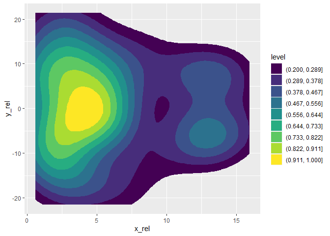<!-- -->

``` r
# JUMBO 
def_ag_JUMBO <- dbGetQuery(con, "SELECT fS.epa, abs(w.x - x_b) as x_rel, (w.y - y_b) as y_rel, w.displayName, w.playId,
                                  w.gameId, w.team, w.playDirection, fS.success FROM football_inSnap1 as fS JOIN allWeeks as w ON fS.gameId = w.gameId
                                  AND fS.playId = w.playId WHERE w.event = 'ball_snap' AND w.team NOT IN(fS.possessionTeam, 'football')
                                  AND fS.offenseFormation = 'JUMBO'")
plots <- relGraphs(def_ag_JUMBO, "def_ag_JUMBO_Best", "def_ag_JUMBO_Win","def_ag_JUMBO_BestWin")
plots[[3]]
```

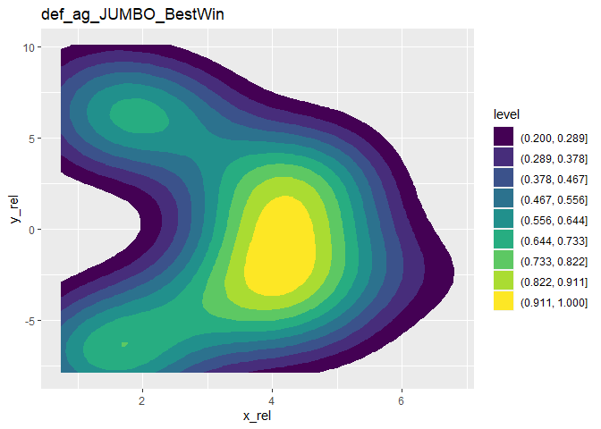<!-- -->

``` r
# EMPTY
def_ag_EMPTY <- dbGetQuery(con, "SELECT fS.epa, abs(w.x - x_b) as x_rel, (w.y - y_b) as y_rel, w.displayName, w.playId,
                                  w.gameId, w.team, w.playDirection, fS.success FROM football_inSnap1 as fS JOIN allWeeks as w ON fS.gameId = w.gameId
                                  AND fS.playId = w.playId WHERE w.event = 'ball_snap' AND w.team NOT IN(fS.possessionTeam, 'football')
                                  AND fS.offenseFormation = 'EMPTY'")
plots <- relGraphs(def_ag_EMPTY, "def_ag_EMPTY_Best", "def_ag_EMPTY_Win","def_ag_EMPTY_BestWin")
plots[[3]]
```

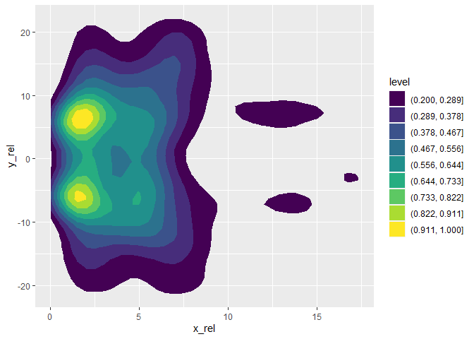<!-- -->

# Общие heatmaps лучшего расположения защиты по ярдлиниям

``` r
# Для защиты по ярдлинии от тачдауна
printYardsGraph <- function(strYardsfrom, strYardsto){
    strYardsfrom <- toString(strYardsfrom)
    strYardsto <- toString(strYardsto)
    def_yft <- dbGetQuery(con, paste0("SELECT fS.epa, abs(w.x - x_b) as x_rel, (w.y - y_b) as y_rel,
                                  w.displayName, w.playId, w.gameId, w.team, w.playDirection, fS.success 
                                  FROM football_inSnap1 as fS
                                  JOIN allWeeks as w ON fS.gameId = w.gameId
                                  AND fS.playId = w.playId WHERE w.event = 'ball_snap'
                                  AND w.team NOT IN(fS.possessionTeam, 'football')
                                  AND fS.yardFromDefTouch > ", strYardsfrom, " AND fS.yardFromDefTouch <= ", strYardsto))
    plots <- relGraphs(def_yft, paste0("def_yft_", strYardsfrom, "_", strYardsto, "_Best"),
                       paste0("def_yft_", strYardsfrom, "_", strYardsto, "_Win"),
                       paste0("def_yft_", strYardsfrom, "_", strYardsto, "_BestWin"))
    print(plots[[3]]) # BestWin
    return(plots)
}

##### DIFFERENT TYPES OF YARDLINES #####################################################

# 0-10
yardsHeat <- printYardsGraph(0, 10)
```

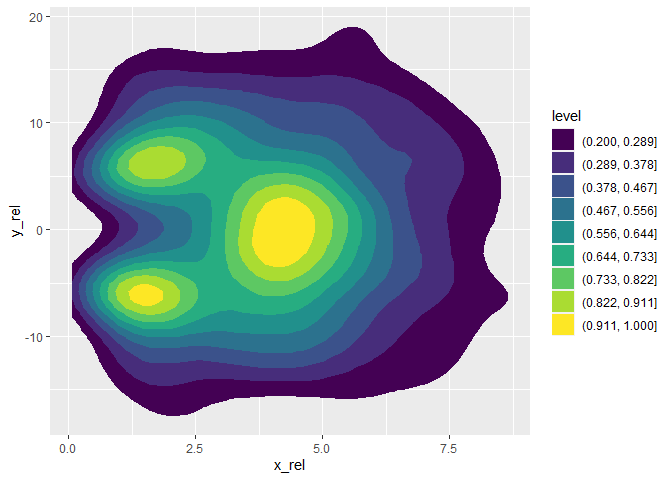<!-- -->

``` r
# 10-20
yardsHeat <- printYardsGraph(10, 20)
```

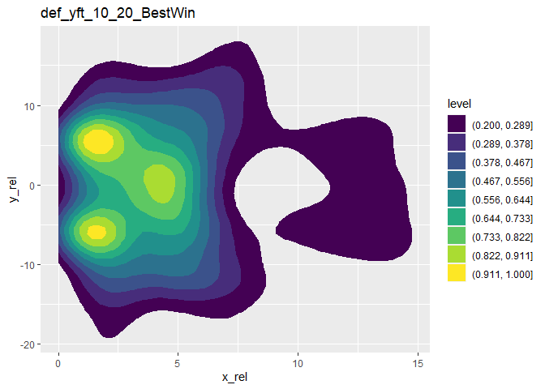<!-- -->

``` r
# 30-40
yardsHeat <- printYardsGraph(30, 40)
```

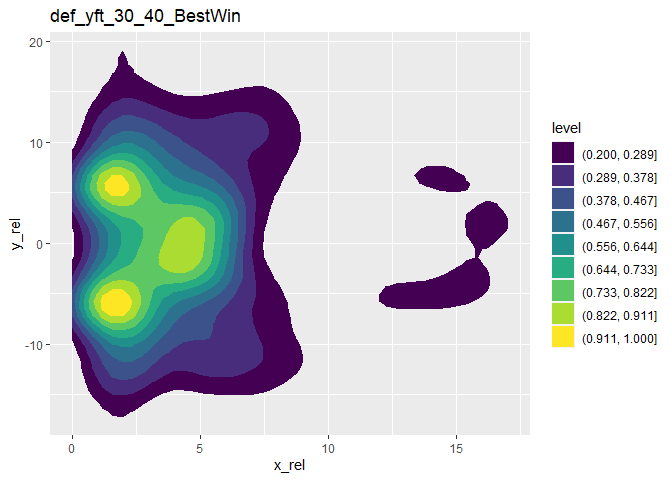<!-- -->

``` r
# 40-55
yardsHeat <- printYardsGraph(40, 55)
```

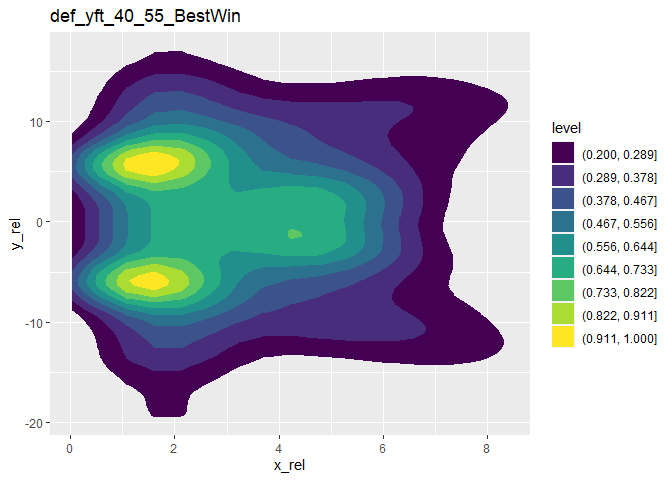<!-- -->

``` r
# 55-70
yardsHeat <- printYardsGraph(55, 70)
```

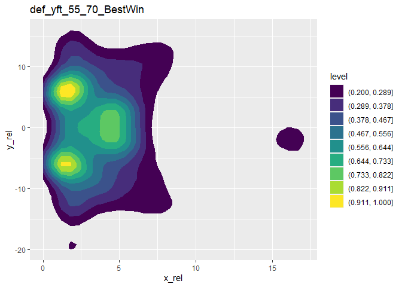<!-- -->

``` r
# 70-85
yardsHeat <- printYardsGraph(70, 85)
```

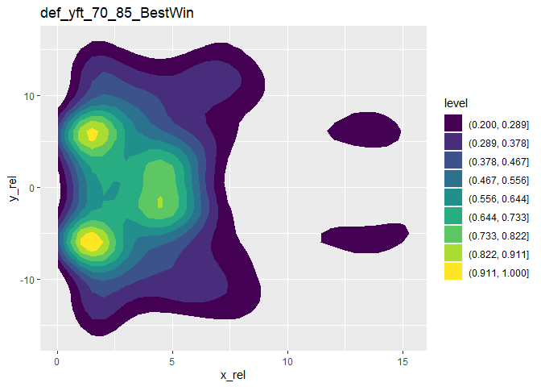<!-- -->

``` r
# 85-100
yardsHeat <- printYardsGraph(85, 100)
```

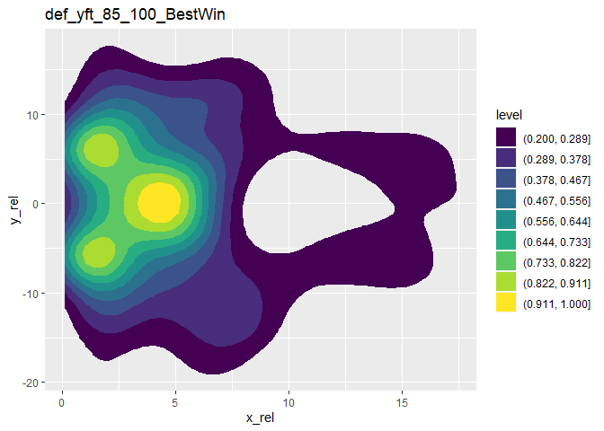<!-- -->

# Лучшее расположение защиты по ролям защитников

  - Heatmaps

<!-- end list -->

``` r
# подготовка вспомогательного dataframe
### разные по ролям UNIVERSAL
roleTypes <- dbGetQuery(con, "SELECT position, COUNT(DISTINCT(playId)) as popularity FROM allWeeks
                                GROUP BY position ORDER BY popularity DESC")
roleTypes
```

    ##    position popularity
    ## 1        QB       4592
    ## 2                 4592
    ## 3        WR       4590
    ## 4        CB       4590
    ## 5        TE       4577
    ## 6        RB       4561
    ## 7       OLB       4444
    ## 8        FS       4371
    ## 9        SS       4271
    ## 10      ILB       3948
    ## 11       LB       3608
    ## 12      MLB       3309
    ## 13       DB       3058
    ## 14        S       1367
    ## 15       HB        590
    ## 16       FB        580
    ## 17       DE        137
    ## 18       DL         37
    ## 19       DT         23
    ## 20        P         16
    ## 21       LS         16
    ## 22       NT          5
    ## 23        K          5

``` r
# Функция получения базовой информации относительно роли (типа) игрока
printPlayerTypeGraph <- function(strType){
  i_def_pos <- dbGetQuery(con, paste0("SELECT fS.epa, abs(w.x - x_b) as x_rel, (w.y - y_b) as y_rel, w.displayName, w.playId,
                                      w.gameId, w.team, fS.success, w.position FROM football_inSnap1 as fS
                                      JOIN allWeeks as w ON fS.gameId = w.gameId AND fS.playId = w.playId
                                      WHERE w.event = 'ball_snap' AND w.team NOT IN(fS.possessionTeam, 'football')
                                      AND w.position = '", strType, "'"))
  if (strType == ""){
    strType = "NO"
  }
  plots <- relGraphs(i_def_pos, paste0(strType, "_def_posBest"),
                     paste0(strType, "_def_posWin"), paste0(strType, "_def_posBestWin"))
  #print(plots[[3]])
  return(plots)
}

# Функция рисования heatmap относительно роли (типа) игрока и определения ключевых точек
### Возвращает или df с полями x y type density. Если пусто то density = 0, если 1 строка, то density = 1
playerTypeGraphDraw <- function(strType){
  playerTypeGraph <- printPlayerTypeGraph(strType)
  
  if (strType == ""){
    strType = "NO"
  }
  
  nrowsdf <- nrow(playerTypeGraph[[4]])
  if(nrowsdf > 1){
    rel_max <- extractMultiMaxDensityXYrelCLUST(playerTypeGraph[[4]])
    rel_max$type <- strType
    
    densPlot <- playerTypeGraph[[3]]
    for (i in 1:(nrow(rel_max))) {
      densPlot <- densPlot + geom_vline(xintercept = rel_max$x[i], colour = i) + 
        geom_hline(yintercept = rel_max$y[i], colour = i)
    }
    densPlot <- densPlot + geom_point(data = rel_max, mapping = aes(x,y), color = "red", size = 5)
    
    print(densPlot + #geom_vline(xintercept = rel_max$x) + geom_hline(yintercept = rel_max$y) +
            labs(subtitle = paste0("x_rel_best = ", rel_max$x, " y_rel_best = ", rel_max$y)))
  } else {
    if(nrowsdf == 1){
      rel_max <- data.frame(x = plots[[4]]$x_rel, y = plots[[4]]$y_rel, density = 1)
      rel_max$type <- strType
    } else {
      rel_max <- data.frame(x = 0, y = 0, density = 0)
      rel_max$type <- strType
    }
    
  }
  return(rel_max)
}
```

Пример использования

``` r
strType <- "CB"
playerTypeGraphDraw(strType)
```

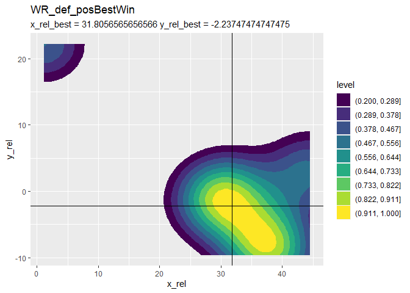<!-- -->

    ##         x         y density type
    ## 1 1.63697 -10.63444       1   CB
    ## 2 2.17596  10.90111       1   CB

Можно автоматически в цикле

    for (i in 1:(nrow(roleTypes))) {
      strType <- roleTypes[i,1]
      playerTypeGraphDraw(strType)
    }

  - “Тихий вариант без heatmaps” (убрать, немного переписать функцию
    сверху return \#TODO )

<!-- end list -->

``` r
### Возвращает или df с полями x y type density. Если пусто то density = 0, если 1 строка, то density = 1
printPlayerTypeBestPos <- function(strType){
  plots <- printPlayerTypeGraph(strType)
  #print(plots[[3]])
  if (strType == ""){
    strType = "NO"
  }
  
  nrowsdf <- nrow(plots[[4]])
  if(nrowsdf > 1){
    rel_max <- extractMultiMaxDensityXYrelCLUST(plots[[4]])
  } else {
    if(nrowsdf == 1){
      rel_max <- data.frame(x = plots[[4]]$x_rel, y = plots[[4]]$y_rel, density = 1)
    } else {
      rel_max <- data.frame(x = 0, y = 0, density = 0)
      
    }
  }
  rel_max$type <- strType
  return(rel_max)
} 
```

Пример использования Можно автоматически

    for (i in 1:(nrow(roleTypes))) {
      strType <- roleTypes[i,1]
      playerTypeGraph <- printPlayerTypeBestPos(strType)
      print(playerTypeGraph)
    }
    
    #### Некторые не выбираются потому что в защите его нет
    
    
    ####################################################################################

# Лучшее расположение защиты по ролям защитников и тактикам нападения

  - функции

<!-- end list -->

``` r
##### DETECT POP TACTICS
attackTypes <- dbGetQuery(con, "SELECT offenseFormation, COUNT(DISTINCT(playId)) as popularity FROM plays
                                GROUP BY offenseFormation ORDER BY popularity DESC")
attackTypes
```

    ##   offenseFormation popularity
    ## 1          SHOTGUN       4320
    ## 2       SINGLEBACK       1949
    ## 3            EMPTY       1857
    ## 4           I_FORM        802
    ## 5           PISTOL        246
    ## 6                         138
    ## 7            JUMBO         51
    ## 8          WILDCAT         36

``` r
# Функция выборки общей информации
printPlayersTypeTactics <- function(strType, strAType){
  i_def_pos <- dbGetQuery(con, paste0("SELECT fS.epa, abs(w.x - x_b) as x_rel, (w.y - y_b) as y_rel, w.displayName, w.playId,
                                        w.gameId, w.team, fS.success, w.position FROM football_inSnap1 as fS
                                        JOIN allWeeks as w ON fS.gameId = w.gameId AND fS.playId = w.playId
                                        WHERE w.event = 'ball_snap' AND w.team NOT IN(fS.possessionTeam, 'football')
                                        AND w.position = '", strType, "'", "AND fS.offenseFormation = '", strAType, "'"))
  if (strType == ""){
    strType = "NO"
  }
  if (strAType == ""){
    strAType = "NO"
  }
  
  plots <- relGraphs(i_def_pos, paste0(strAType, "_", strType, "_def_posBest"),
                     paste0(strAType, "_", strType, "_def_posWin"), paste0(strAType, "_", strType, "_def_posBestWin"))
  return(plots)
}

# Функция рисования heatmap и определения ключевых точек
### Возвращает или df с полями x y type density. Если пусто то density = 0, если 1 строка, то density = 1
playerTypeTacticsGraphDraw <- function(strType, strAType){
  playerTypeTacticsGraph <- printPlayersTypeTactics(strType, strAType)
  if (strType == ""){
    strType = "NO"
  }
  if (strAType == ""){
    strAType = "NO"
  }
  
  nrowsdf <- nrow(playerTypeTacticsGraph[[4]])
  if(nrowsdf > 1){
    rel_max <- extractMultiMaxDensityXYrelCLUST(playerTypeTacticsGraph[[4]])
    densPlot <- playerTypeTacticsGraph[[3]]
    for (i in 1:(nrow(rel_max))) {
      densPlot <- densPlot + geom_vline(xintercept = rel_max$x[i], colour = i) + 
        geom_hline(yintercept = rel_max$y[i], colour = i)
    }
    densPlot <- densPlot + geom_point(data = rel_max, mapping = aes(x,y), color = "red", size = 5)
    
    print(densPlot)# + #geom_vline(xintercept = rel_max$x) + geom_hline(yintercept = rel_max$y) +
            #labs(subtitle = paste0("x_rel_best = ", rel_max$x, " y_rel_best = ", rel_max$y)))
  } else {
    if(nrowsdf == 1){
      rel_max <- data.frame(x = plots[[4]]$x_rel, y = plots[[4]]$y_rel, density = 1)
    } else {
      rel_max <- data.frame(x = 0, y = 0, density = 0)
    }
    
  }
  rel_max$type <- strType
  rel_max$Atype <- strAType
  return(rel_max)
}
```

Пример использования

``` r
strAType <- "SHOTGUN"
strType <- "MLB"
playerTypeTacticsGraphDraw(strType, strAType)
```

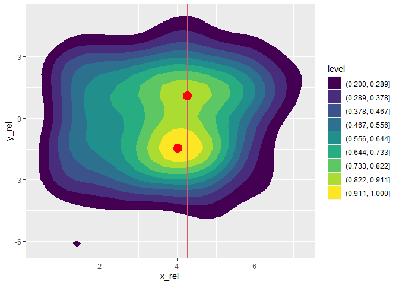<!-- -->

    ##          x         y density type   Atype
    ## 1 4.009949 -1.462222       1  MLB SHOTGUN
    ## 2 4.258333  1.098889       1  MLB SHOTGUN

Можно автоматически

    for (i in 1:(nrow(attackTypes))) {
      strAType <- attackTypes[i,1]
      for (j in 1:(nrow(roleTypes))) {
        strType <- roleTypes[j,1]
        rel_max <- playerTypeTacticsGraphDraw(strType, strAType)
        print(rel_max)
        #rbind
        #write.csv()
      }
    }
    
    strAType <- "I_FORM"
    for (j in 1:(nrow(roleTypes))) {
      strType <- roleTypes[j,1]
      playerTypeGraph <- playerTypeTacticsGraphDraw(strType, strAType)
      Idata <- rbind(Idata, playerTypeGraph)
      print(playerTypeGraph)
    }

Тихий вариант (убрать \#TODO)

``` r
printPlayerTacticsTypeBestPos <- function(strType, strAType){
  
  plots <- printPlayersTypeTactics(strType, strAType)
  if (strType == ""){
    strType = "NO"
  }
  if (strAType == ""){
    strAType = "NO"
  }
  
  #print(plots[[3]])
  nrowsdf <- nrow(plots[[4]])
  if(nrowsdf > 1){
    rel_max <- extractMultiMaxDensityXYrelCLUST(plots[[4]])
  } else {
    if(nrowsdf == 1){
      rel_max <- data.frame(x = plots[[4]]$x_rel, y = plots[[4]]$y_rel, density = 1)
    } else {
      rel_max <- data.frame(x = 0, y = 0, density = 0)
    }
  }
  rel_max$type <- strType
  rel_max$Atype <- strAType
  return(rel_max)
} 


strAType <- "SHOTGUN"
strType <- "MLB"
printPlayerTacticsTypeBestPos(strType, strAType)
```

    ##          x         y density type   Atype
    ## 1 4.009949 -1.462222       1  MLB SHOTGUN
    ## 2 4.258333  1.098889       1  MLB SHOTGUN

\#Используя разработанные функции легко также нарисовать и для атаки

``` r
##### DETECT POP TACTICS
attackTypes <- dbGetQuery(con, "SELECT offenseFormation, COUNT(DISTINCT(playId)) as popularity FROM plays
                                GROUP BY offenseFormation ORDER BY popularity DESC")
attackTypes
```

    ##   offenseFormation popularity
    ## 1          SHOTGUN       4320
    ## 2       SINGLEBACK       1949
    ## 3            EMPTY       1857
    ## 4           I_FORM        802
    ## 5           PISTOL        246
    ## 6                         138
    ## 7            JUMBO         51
    ## 8          WILDCAT         36

``` r
###ATTACK
printPlayersTypeTacticsAttack <- function(strType, strAType){
  i_def_pos <- dbGetQuery(con, paste0("SELECT fS.epa, -abs(w.x - x_b) as x_rel, (w.y - y_b) as y_rel, w.displayName, w.playId,
                                        w.gameId, w.team, fS.success, w.position FROM football_inSnap1 as fS
                                        JOIN allWeeks as w ON fS.gameId = w.gameId AND fS.playId = w.playId
                                        WHERE w.event = 'ball_snap' AND w.team = fS.possessionTeam
                                        AND w.position = '", strType, "'", "AND fS.offenseFormation = '", strAType, "'"))
  if (strType == ""){
    strType = "NO"
  }
  if (strAType == ""){
    strAType = "NO"
  }
  
  plots <- relGraphsAttack(i_def_pos, paste0(strAType, "_", strType, "_def_posBest"),
                     paste0(strAType, "_", strType, "_def_posWin"), paste0(strAType, "_", strType, "_def_posBestWin"))
  return(plots)
} 

# Функция рисования heatmap и определения ключевых точек
### Возвращает или df с полями x y type density. Если пусто то density = 0, если 1 строка, то density = 1
# ATTACK
playerTypeTacticsGraphDrawAttack <- function(strType, strAType){
  playerTypeTacticsGraph <- printPlayersTypeTacticsAttack(strType, strAType)
  if (strType == ""){
    strType = "NO"
  }
  if (strAType == ""){
    strAType = "NO"
  }
  
  nrowsdf <- nrow(playerTypeTacticsGraph[[4]])
  if(nrowsdf > 1){
    rel_max <- extractMultiMaxDensityXYrelCLUST(playerTypeTacticsGraph[[4]])
    densPlot <- playerTypeTacticsGraph[[3]]
    for (i in 1:(nrow(rel_max))) {
      densPlot <- densPlot + geom_vline(xintercept = rel_max$x[i], colour = i) + 
        geom_hline(yintercept = rel_max$y[i], colour = i)
    }
    densPlot <- densPlot + geom_point(data = rel_max, mapping = aes(x,y), color = "red", size = 5)
    
    print(densPlot + #geom_vline(xintercept = rel_max$x) + geom_hline(yintercept = rel_max$y) +
            labs(subtitle = paste0("x_rel_best = ", rel_max$x, " y_rel_best = ", rel_max$y)))
  } else {
    if(nrowsdf == 1){
      rel_max <- data.frame(x = plots[[4]]$x_rel, y = plots[[4]]$y_rel, density = 1)
    } else {
      rel_max <- data.frame(x = 0, y = 0, density = 0)
    }
    
  }
  rel_max$type <- strType
  rel_max$Atype <- strAType
  return(rel_max)
}
```

Пример использования

``` r
strAType <- "SHOTGUN"
strType <- "TE"
playerTypeTacticsGraphDrawAttack(strType, strAType)
```

    ## Warning: did not converge in 10 iterations
    
    ## Warning: did not converge in 10 iterations
    
    ## Warning: did not converge in 10 iterations
    
    ## Warning: did not converge in 10 iterations
    
    ## Warning: did not converge in 10 iterations
    
    ## Warning: did not converge in 10 iterations
    
    ## Warning: did not converge in 10 iterations
    
    ## Warning: did not converge in 10 iterations
    
    ## Warning: did not converge in 10 iterations
    
    ## Warning: did not converge in 10 iterations
    
    ## Warning: did not converge in 10 iterations
    
    ## Warning: did not converge in 10 iterations

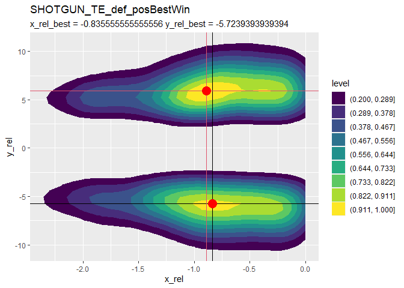<!-- -->

    ##            x         y density type   Atype
    ## 1 -0.8355556 -5.723939       1   TE SHOTGUN
    ## 2 -0.8877778  5.905152       1   TE SHOTGUN

Можно автоматически

    for (i in 1:(nrow(attackTypes))) {
      strAType <- attackTypes[i,1]
      for (j in 1:(nrow(roleTypes))) {
        strType <- roleTypes[j,1]
        playerTypeTacticsGraphDrawAttack(strType, strAType)
      }
    }
    
    
    roleTypes <- dbGetQuery(con, "SELECT w.position, COUNT(DISTINCT(w.nflid)) as popularity FROM allWeeks as w
                                  JOIN football_inSnap1 as fS ON fS.gameId = w.gameId AND fS.playId = w.playId
                                  WHERE w.team = fS.possessionTeam
                                  GROUP BY position ORDER BY popularity DESC")
    roleTypes
    Idata <- data.frame(x=double(),
                        y=double(),
                        density=double(),
                        type=character(),
                        Atype=character()) 
    strAType <- "I_FORM"
      for (j in 1:(nrow(roleTypes))) {
        strType <- roleTypes[j,1]
        playerTypeGraphAttack <- playerTypeTacticsGraphDrawAttack(strType, strAType)
        
        Idata <- rbind(Idata, subset(playerTypeGraphAttack, select = x:Atype))
      }
    write.csv(Idata, "IAttack.csv")

Тихие варианты \#Убрать? \#TODO (В общем нужен IF в основной)

``` r
printPlayerTacticsTypeBestPos <- function(strType, strAType){
  
  plots <- printPlayersTypeTactics(strType, strAType)
  if (strType == ""){
    strType = "NO"
  }
  if (strAType == ""){
    strAType = "NO"
  }
  
  #print(plots[[3]])
  nrowsdf <- nrow(plots[[4]])
  if(nrowsdf > 1){
    rel_max <- extractMultiMaxDensityXYrelCLUST(plots[[4]])
  } else {
    if(nrowsdf == 1){
      rel_max <- data.frame(x = plots[[4]]$x_rel, y = plots[[4]]$y_rel, density = 1)
    } else {
      rel_max <- data.frame(x = 0, y = 0, density = 0)
    }
  }
  rel_max$type <- strType
  rel_max$Atype <- strAType
  return(rel_max)
} 
```

    #loop
    for (i in 1:(nrow(attackTypes))) {
      strAType <- attackTypes[i,1]
      for (j in 1:(nrow(roleTypes))) {
        strType <- roleTypes[j,1]
        playerTypeGraph <- printPlayerTacticsTypeBestPos(strType, strAType)
        print(playerTypeGraph)
      }
    }

    ###ATTACK
    printPlayerTacticsTypeBestPosAttack <- function(strType, strAType){
      
      plots <- printPlayersTypeTacticsAttack(strType, strAType)
      if (strType == ""){
        strType = "NO"
      }
      if (strAType == ""){
        strAType = "NO"
      }
      
      #print(plots[[3]])
      nrowsdf <- nrow(plots[[4]])
      if(nrowsdf > 1){
        rel_max <- extractMultiMaxDensityXYrelCLUST(plots[[4]])
      } else {
        if(nrowsdf == 1){
          rel_max <- data.frame(x = plots[[4]]$x_rel, y = plots[[4]]$y_rel, density = 1)
        } else {
          rel_max <- data.frame(x = 0, y = 0, density = 0)
        }
      }
      rel_max$type <- strType
      rel_max$Atype <- strAType
      return(rel_max)
    } 

    #loop
    for (i in 1:(nrow(attackTypes))) {
      strAType <- attackTypes[i,1]
      for (j in 1:(nrow(roleTypes))) {
        strType <- roleTypes[j,1]
        playerTypeGraph <- printPlayerTacticsTypeBestPos(strType, strAType)
        print(playerTypeGraph)
      }
    }

```` 

```r
# $$$$$$$$$$$$$$ #
# готовые решения:
# printPlayerTypeBestPos(strType) - возвращает лучшую позицию игрока по типу независимо от типа Атаки
# playerTypeGraphDraw(strType) - рисует графики и выводит, ничего не возвращае
# printPlayerTacticsTypeBestPos(strType, strAType) - возвращает лучшую позицию. strType - тип игрока, strAType - тип атаки
# playerTypeTacticsGraphDraw(strType, strAType) - рисует графики и выводит, ничего не возвращает

#Пример использования:
printPlayerTypeBestPos("OLB")
````

    ##          x         y density type
    ## 1 1.108485 -5.382929       1  OLB
    ## 2 1.108485  5.942828       1  OLB

``` r
playerTypeGraphDraw("OLB")
```

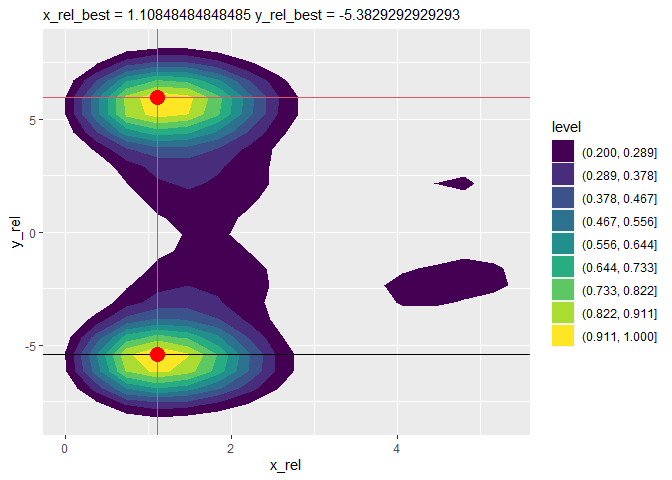<!-- -->

    ##          x         y density type
    ## 1 1.108485 -5.382929       1  OLB
    ## 2 1.108485  5.942828       1  OLB

``` r
printPlayerTacticsTypeBestPos("OLB", "SHOTGUN")
```

    ##          x         y density type   Atype
    ## 1 1.067273 -5.408485       1  OLB SHOTGUN
    ## 2 1.304444  5.686515       1  OLB SHOTGUN

``` r
playerTypeTacticsGraphDraw("OLB", "SHOTGUN")
```

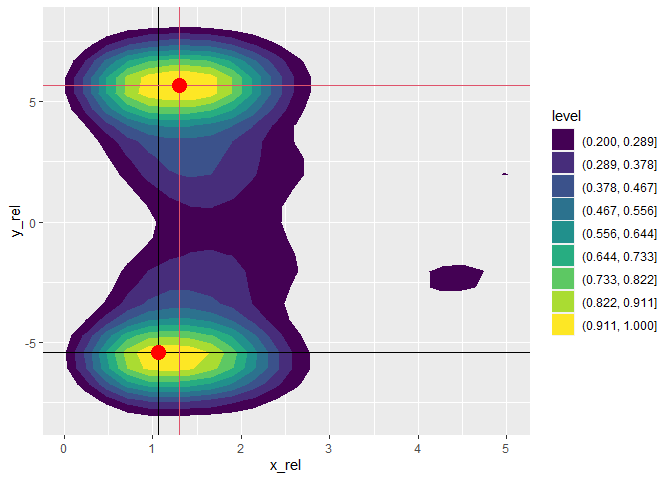<!-- -->

    ##          x         y density type   Atype
    ## 1 1.067273 -5.408485       1  OLB SHOTGUN
    ## 2 1.304444  5.686515       1  OLB SHOTGUN

``` r
# end

dbDisconnect(con)
```

\#TODO: - Тихие - Сравнить с Worst?

    ######################################################## NOT USED BUT DONE ##############################################
    if(FALSE){
     #### COUNTOR EXPERIMENT
     #################################### FUNC IT #####################
     extractMultiMaxDensityXYrel <- function(dataframe){
       rel_max <- data.frame(x=double(),
                             y=double(),
                             density=double()) 
       
       dataframe <- dfBest
       kde <- kde2d(dataframe$x_rel, dataframe$y_rel, n = 100)
       #contour(kde, xlab = "x_rel", ylab = "y_rel" )
       r <- raster(kde)
       dfKde <- as.data.frame(r, xy=T) #layer == density
       xyD <- aggregate(dfKde$layer, by = list(dfKde$x, dfKde$y), FUN = max)
       names(xyD)[names(xyD) == "x"] <- "density"
       names(xyD)[names(xyD) == "Group.1"] <- "x"
       names(xyD)[names(xyD) == "Group.2"] <- "y"
       
       #dens90 <- min(xyD$density) + (max(xyD$density) - min(xyD$density)) * 90/100 ###Pending
       dens90 <- min(xyD$density) + (max(xyD$density) - min(xyD$density)) * 80/100 ###Pending
       xyDmax <- xyD[xyD$density > dens90,]
       cnt <- getContourLines(xyDmax$x, xyDmax$y, xyDmax$density, nlevels = 2)# bin = 2)
       
       difGID <- unique(cnt$GID)
       
       for (i in 1:(length(difGID))) {
         tCnt <- cnt[cnt$GID==difGID[i],]
         rel_max <- rbind(rel_max, data.frame(x = summary(tCnt$x)[[3]], y = summary(tCnt$y)[[3]], density = 1))
       }
       #rel_max <- xyD[xyD$density == max(xyD$density),]
       return(rel_max)
     }
    }
