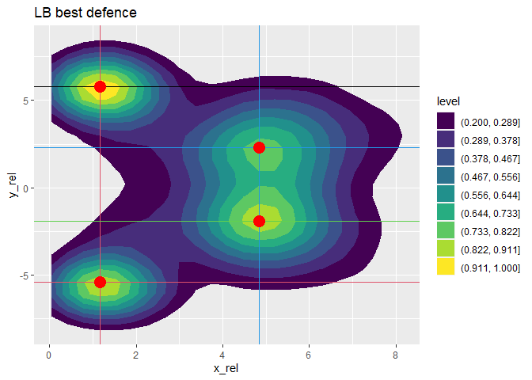

# Heatmaps, best positions
  
  Американский футбол, тактически очень динамичная игра. Для каждой схватки команда может менять состав команды и естественно расположение игроков и тактику.
  В этом модуле мы исследуем данные и определим лучшие расположения игроков защиты в игровой момент в зависимости от роли, типа атаки противника, ярдлинии. Определим лучшую компановку команды защиты от типа атаки противника. Также определим лучшее расположение для команды атаки.

### Setup

```r
library(DBI)
library(ggplot2)
library(dplyr)
library(MASS)
library(raster)
library(viridis)
library(factoextra)
library(photobiology)
knitr::opts_knit$set(root.dir = "D:/MyFilesDesktop/Student/7SEM/DataScience/DS_Project")
```

## Подготовка данных
#### Заполнение общими данными

```r
con <- dbConnect(RSQLite::SQLite(), ":memory:")
dbWriteTable(con, "games", read.csv("data/games.csv"))
dbWriteTable(con, "allWeeks", read.csv("data/week1.csv"))
dbAppendTable(con, "allWeeks", read.csv("data/week2.csv"))
dbAppendTable(con, "allWeeks", read.csv("data/week3.csv"))
dbAppendTable(con, "allWeeks", read.csv("data/week4.csv"))
dbAppendTable(con, "allWeeks", read.csv("data/week5.csv"))
dbAppendTable(con, "allWeeks", read.csv("data/week6.csv"))
dbAppendTable(con, "allWeeks", read.csv("data/week7.csv"))
dbAppendTable(con, "allWeeks", read.csv("data/week8.csv"))
dbAppendTable(con, "allWeeks", read.csv("data/week9.csv"))
dbAppendTable(con, "allWeeks", read.csv("data/week10.csv"))
dbAppendTable(con, "allWeeks", read.csv("data/week11.csv"))
dbAppendTable(con, "allWeeks", read.csv("data/week12.csv"))
dbAppendTable(con, "allWeeks", read.csv("data/week13.csv"))
dbAppendTable(con, "allWeeks", read.csv("data/week14.csv"))
dbAppendTable(con, "allWeeks", read.csv("data/week15.csv"))
dbAppendTable(con, "allWeeks", read.csv("data/week16.csv"))
dbAppendTable(con, "allWeeks", read.csv("data/week17.csv"))
```

#### Таблица plays
  Чистых данных для нашего исследования недостаточно. Требуется добавить дополнительные колонки, например yardFromDefTouch отражает расстояние от линии тачдауна защищающихся, этой характеристики в данных нет, но она отражает напряженность игрового момента, чем это значение ниже, тем выше цена ошибки защиты.

```r
# Add additional column for statistic:
# - success
# - yardFromDefTouch
plays <- read.csv("data/plays.csv")
plays$success <- 0
plays$success[plays$playResult >= plays$yardsToGo] <- 1
plays$yardFromDefTouch <- 0
dbWriteTable(con, "plays", plays)
dbExecute(con, "UPDATE plays SET yardFromDefTouch = CASE 
                WHEN (possessionTeam = yardlineSide) THEN (100 - yardlineNumber) 
                ELSE yardlineNumber
                END")
```

  Просмотрим наши данные. 

```r
dbListTables(con)
```

```
## [1] "allWeeks" "games"    "plays"
```

```r
dbGetQuery(con, "SELECT COUNT(*) FROM allWeeks")
```

```
##   COUNT(*)
## 1 18309388
```

```r
testTeam <- head(dbGetQuery(con, "SELECT DISTINCT w.nflId, w.team FROM plays as p JOIN allWeeks as w ON p.gameId = w.gameId
                                      AND p.playId = w.playId WHERE w.gameId = 2018090600
                                      ORDER BY w.nflId"),10)#60)
testTeam
```

```
##      nflId     team
## 1       NA football
## 2      310     away
## 3    79848     home
## 4  2495454     away
## 5  2495613     home
## 6  2506467     home
## 7  2507763     home
## 8  2507828     away
## 9  2532842     home
## 10 2533040     away
```

```r
testFrames <- head(dbGetQuery(con, "SELECT w.frameId, w.playId, COUNT(w.nflId), COUNT(w.displayName) FROM plays as p JOIN allWeeks as w ON p.gameId = w.gameId
                                      AND p.playId = w.playId WHERE w.gameId = 2018090600
                                      GROUP BY w.frameId, w.playId ORDER BY w.playId"),10)#60
testFrames
```

```
##    frameId playId COUNT(w.nflId) COUNT(w.displayName)
## 1        1     75             13                   14
## 2        2     75             13                   14
## 3        3     75             13                   14
## 4        4     75             13                   14
## 5        5     75             13                   14
## 6        6     75             13                   14
## 7        7     75             13                   14
## 8        8     75             13                   14
## 9        9     75             13                   14
## 10      10     75             13                   14
```
  testFrames запрос показал, что количество игроков каждом фрейме одного момента одинаковое, поэтому смело можно брать ball_snap кадр и мы получим данные о всех зафиксированных игроках в моменте

  testTeam запрос дал нам понять, что команда у игрока во время игры не меняется, но мы знаем что меняется сторона. В чистых данных колонка в plays содержит трехбуквенные значения команд, что не позволяет нормально работать с allWeeks, где колонка команды содержит значения 'home' и 'away'. В games есть информация о принимающей (home) команде в виде трехбуквенного значения. Отредактируем наши данные для удобного использования.

```r
dbExecute(con, "UPDATE plays as p SET possessionTeam = 'away'
                WHERE possessionTeam != (SELECT homeTeamAbbr FROM games as g WHERE p.gameId = g.gameId)")
dbExecute(con, "UPDATE plays as p SET possessionTeam = 'home'
                WHERE possessionTeam = (SELECT homeTeamAbbr FROM games as g WHERE p.gameId = g.gameId)")
dbExecute(con, "UPDATE allWeeks SET position = CASE 
                WHEN (position IN('DE', 'DT')) THEN 'DL'
                WHEN (position IN('OLB', 'ILB', 'MLB')) THEN 'LB'
                WHEN (position IN('CB', 'S', 'FS', 'SS')) THEN 'DB'
                ELSE position
                END")
```

#### Проверим наши данные

```r
testTeam1 <- dbGetQuery(con, "SELECT team, COUNT(DISTINCT(playId)) FROM allWeeks as w GROUP BY team")
testTeam1
```

```
##       team COUNT(DISTINCT(playId))
## 1     away                    4591
## 2 football                    4592
## 3     home                    4592
```

```r
testTeamPlay <- dbGetQuery(con, "SELECT possessionTeam, COUNT(DISTINCT(playId)) FROM plays GROUP BY possessionTeam")
testTeamPlay
```

```
##   possessionTeam COUNT(DISTINCT(playId))
## 1           away                    3973
## 2           home                    3992
```
  Мы привели их к удобному для исследования виду

### New ball snap table
  После анализа данных понятно, что расположение игроков на поле очень разнообразно и систематизировать знания об их позициях можно, выявив их координаты относительно положения сбрасывающего во время начала схватки. Этим положением является положение мяча, ведь информации о сбрасывающем игроке в данных нет. А моментом времени является момент ball_snap.
Сделаем вспомогательную таблицу.

```r
dbWriteTable(con, "football_inSnap1", dbGetQuery(con, "SELECT p.epa, w.x as x_b, w.y as y_b, w.displayName, w.event, w.playId,
                                      w.gameId, p.offenseFormation, p.possessionTeam, p.yardFromDefTouch, p.success
                                      FROM plays as p JOIN allWeeks as w ON p.gameId = w.gameId
                                      AND p.playId = w.playId WHERE w.event = 'ball_snap' AND w.displayName = 'Football'"))
```
  Подготовка данных для исследования завершена

## Базовые функции
### Функции построения базовых heatmaps и базовой выборки
  Функции выявляют лучшее расположение по EPA и успеху, как по самым значимым параметрам, выявленным при построении моделей. На вход нужно падать только dataframe и строки для названия heatmaps, которые она вернет вместе с лучшими данными.

```r
# Для защиты
relGraphs <- function(df, strDF, strBestWin){
  summary(df)
  dfBest <- df[df$epa < summary(df$epa)[[2]],]
  dfWin <- df[df$success == 0,]
  dfBestWin <- df[df$epa < summary(df$epa)[[2]] & df$success == 0,]
  
  if(nrow(df) > 1){
    dfPlot <- df %>% 
      ggplot(aes(x = x_rel, y = y_rel)) +
      geom_density2d_filled(contour_var = "ndensity", breaks = seq(0.2, 1.0, length.out = 10)) + 
      labs(title=strDF)
  } else {
    dfPlot <- list(df[,c(2,3)], strDF)
  }
  
  if(nrow(dfBestWin) > 1){
    dfBestWinPlot <- dfBestWin %>% 
      ggplot(aes(x = x_rel, y = y_rel)) +
      geom_density2d_filled(aes(fill = ..level..),
                            contour_var = "ndensity",
                            breaks = seq(0.2, 1.0, length.out = 10)) +
      labs(title=strBestWin)
  } else {
    dfBestWinPlot <- list(dfBestWin[,c(2,3)], strBestWin)
  }
  
  return (list(dfPlot, df, dfBestWinPlot, dfBestWin))
}

# Для атаки
relGraphsAttack <- function(df, strBest, strWin, strBestWin){
  summary(df)
  dfBest <- df[df$epa > summary(df$epa)[[5]],]
  dfWin <- df[df$success == 1,]
  dfBestWin <- df[df$epa > summary(df$epa)[[5]] & df$success == 1,]
  
  if(nrow(dfBest) > 1){
    dfBestPlot <- dfBest %>% 
      ggplot(aes(x = x_rel, y = y_rel)) +
      geom_density2d_filled(contour_var = "ndensity", breaks = seq(0.2, 1.0, length.out = 10)) + 
      labs(title=strBest)
  } else {
    dfBestPlot <- list(dfBest[,c(2,3)], strBest) 
  }
  
  if(nrow(dfWin) > 1){
    dfWinPlot <- dfWin %>% 
      ggplot(aes(x = x_rel, y = y_rel)) +
      geom_density2d_filled(contour_var = "ndensity", breaks = seq(0.2, 1.0, length.out = 10)) + 
      labs(title=strWin)
  } else {
    dfWinPlot <- list(dfWin[,c(2,3)], strWin)
  }
  
  if(nrow(dfBestWin) > 1){
    dfBestWinPlot <- dfBestWin %>% 
      ggplot(aes(x = x_rel, y = y_rel)) +
      geom_density2d_filled(aes(fill = ..level..),
                            contour_var = "ndensity",
                            breaks = seq(0.2, 1.0, length.out = 10)) +
      labs(title=strBestWin)
  } else {
    dfBestWinPlot <- list(dfBestWin[,c(2,3)], strBestWin)
  }
  
  return (list(dfBestPlot, dfWinPlot, dfBestWinPlot, dfBestWin))
}
# EXAMPLE: plots <- relGraphsAttack(WR_def_pos, "WR_def_posBest", "WR_def_posWin","WR_def_posBestWin")
# plots
# or plots[[1]]
```

#### Проверим работу функции
  Построим heatmap лучшего расположение защиты в независимости от факторов

```r
# пробуем соединить по команде (home / away)
# Красота
DefPlayers_inSnap <- dbGetQuery(con, "SELECT fS.epa, abs(w.x - x_b) as x_rel, (w.y - y_b) as y_rel, w.displayName, w.playId,
                                      w.gameId, w.team, w.playDirection, fS.success FROM football_inSnap1 as fS
                                      JOIN allWeeks as w ON fS.gameId = w.gameId AND fS.playId = w.playId
                                      WHERE w.event = 'ball_snap' AND w.team NOT IN(fS.possessionTeam, 'football')")

plots <- relGraphs(DefPlayers_inSnap, "DefPlayers_inSnap","DefPlayers_inSnapBestWin")
plots[[3]]
```

<!-- -->

У нас получилось учесть всех защитников для обоих команд

### Функция выборки ключевых точек
  Данная функция выявляет ключевые точки по плотности. Похожий функционал использует geom_density2d, но получить оттуда информацию можно лишь посмотрев на результат отрисовки. Для автоматической работы это неприемлемо. Поэтому и была написана эта функция. Результат ее использования мы увидим позже в виде полученных наборов точек и пересечений на хитмапах. Из-за сильной зашумленности данных здесь используется сглаживание.
  
  Функция получает на вход dataframe с x y, возвращает dataframe с ключевыми точками. Также можно настроить параметры отбора, в k1 следует подавать число от 0 до 100, которое обозначает уровень в процентах, ниже которого не будет происходить отбор пиковых значений, spy и spx указывают на число соседних значений с двух сторон, выше которых должно быть пиковое значение, чтобы считаться пиком.

```r
extractMultiMaxDensityXYrelULTRA <- function(dataframe, k1 = 60, spy = 5, spx = spy){
    rel_max <- data.frame(x=double(),
                          y=double(),
                          density=double())
    kde <- kde2d(dataframe$x_rel, dataframe$y_rel, n = 100)
    r <- raster(kde)
    dfKde <- as.data.frame(r, xy=T) #layer == density
    xyD <- aggregate(dfKde$layer, by = list(dfKde$x, dfKde$y), FUN = max)
    names(xyD)[names(xyD) == "x"] <- "density"
    names(xyD)[names(xyD) == "Group.1"] <- "x"
    names(xyD)[names(xyD) == "Group.2"] <- "y"
    dens60 <- min(xyD$density) + (max(xyD$density) - min(xyD$density)) * k1/100
    xyDmax <- xyD[xyD$density > dens60,]

    find_peaksAll <- data.frame(find_peaks(data.frame(peak = xyDmax$density)))
    find_peaksAll <- subset(find_peaksAll, peak == TRUE)
    peaksXY <- data.frame(x = xyDmax$x, y = xyDmax$y, density = xyDmax$density)[rownames(find_peaksAll),]
    
    lo <- loess(peaksXY$density ~ peaksXY$y)#$fitted
    lodf <- data.frame(y = lo$x, density = lo$y)
    names(lodf)[names(lodf) == "peaksXY.y"] <- "y"
    
    find_peaks <- data.frame(find_peaks(data.frame(peak = lodf$density), span = spy))
    find_peaks <- subset(find_peaks, peak == TRUE)
    if (nrow(find_peaks) == 0 || spy == 1){
      peaksYlo <- subset(lodf, density == max(lodf$density))
    } else {
      peaksYlo <- data.frame(y = lodf$y, density = lodf$density)[rownames(find_peaks),]
    }
    
    peaksXY <- peaksXY[order(peaksXY$x),]
    loX <- loess(peaksXY$density ~ peaksXY$x)
    lodfX <- data.frame(y = loX$x, density = loX$y)
    names(lodfX)[names(lodfX) == "peaksXY.x"] <- "x"
    find_peaksX <- data.frame(find_peaks(data.frame(peak = lodfX$density), span = spx))
    find_peaksX <- subset(find_peaksX, peak == TRUE)
    if (nrow(find_peaksX) == 0 || spx == 1){
      peaksXlo <- subset(lodfX, density == max(lodfX$density))
    } else {
      peaksXlo <- data.frame(x = lodfX$x, density = lodfX$density)[rownames(find_peaksX),]
    }
    
    for(i in 1:nrow(peaksYlo)){
      rel_max <- rbind(rel_max, data.frame(x = peaksXY[peaksXY$density == peaksYlo$density[i] & peaksXY$y == peaksYlo$y[i],]$x,
                                           y = peaksYlo$y[i],
                                           density = peaksYlo$density[i]))
    }
    for(i in 1:nrow(peaksXlo)){
      rel_max <- rbind(rel_max, data.frame(x = peaksXlo$x[i],
                                           y = peaksXY[peaksXY$density == peaksXlo$density[i] & peaksXY$x == peaksXlo$x[i],]$y,
                                           density = peaksXlo$density[i]))
    }
    rel_max <- unique(rel_max)
    rel_max <- rel_max[order(-rel_max$density),]
    return(rel_max)
  }
```

### Использование

#### Общие heatmaps лучшего расположения против всех типов атак по их популярности

```r
### разные типы атак
# SINGLEBACK
def_ag_SINGLEBACK <- dbGetQuery(con, "SELECT fS.epa, abs(w.x - x_b) as x_rel, (w.y - y_b) as y_rel, w.displayName, w.playId,
                                  w.gameId, w.team, w.playDirection, fS.success FROM football_inSnap1 as fS JOIN allWeeks as w ON fS.gameId = w.gameId
                                  AND fS.playId = w.playId WHERE w.event = 'ball_snap' AND w.team NOT IN(fS.possessionTeam, 'football')
                                  AND fS.offenseFormation = 'SINGLEBACK'")
plots <- relGraphs(def_ag_SINGLEBACK, "def_ag_SINGLEBACK", "def_ag_SINGLEBACK_BestWin")
plots[[3]]
```

<!-- -->

```r
# SHOTGUN
def_ag_SHOTGUN <- dbGetQuery(con, "SELECT fS.epa, abs(w.x - x_b) as x_rel, (w.y - y_b) as y_rel, w.displayName, w.playId,
                                  w.gameId, w.team, w.playDirection, fS.success FROM football_inSnap1 as fS JOIN allWeeks as w ON fS.gameId = w.gameId
                                  AND fS.playId = w.playId WHERE w.event = 'ball_snap' AND w.team NOT IN(fS.possessionTeam, 'football')
                                  AND fS.offenseFormation = 'SHOTGUN'")
plots <- relGraphs(def_ag_SHOTGUN, "def_ag_SHOTGUN", "def_ag_SHOTGUN_BestWin")
plots[[3]]
```

<!-- -->

```r
# PISTOL
def_ag_PISTOL <- dbGetQuery(con, "SELECT fS.epa, abs(w.x - x_b) as x_rel, (w.y - y_b) as y_rel, w.displayName, w.playId,
                                  w.gameId, w.team, w.playDirection, fS.success FROM football_inSnap1 as fS JOIN allWeeks as w ON fS.gameId = w.gameId
                                  AND fS.playId = w.playId WHERE w.event = 'ball_snap' AND w.team NOT IN(fS.possessionTeam, 'football')
                                  AND fS.offenseFormation = 'PISTOL'")
plots <- relGraphs(def_ag_PISTOL, "def_ag_PISTOL", "def_ag_PISTOL_BestWin")
plots[[3]]
```

<!-- -->

```r
# I_FORM
def_ag_I_FORM <- dbGetQuery(con, "SELECT fS.epa, abs(w.x - x_b) as x_rel, (w.y - y_b) as y_rel, w.displayName, w.playId,
                                  w.gameId, w.team, w.playDirection, fS.success  FROM football_inSnap1 as fS JOIN allWeeks as w ON fS.gameId = w.gameId
                                  AND fS.playId = w.playId WHERE w.event = 'ball_snap' AND w.team NOT IN(fS.possessionTeam, 'football')
                                  AND fS.offenseFormation = 'I_FORM'")
plots <- relGraphs(def_ag_I_FORM, "def_ag_I_FORM", "def_ag_I_FORM_BestWin")
plots[[3]]
```

<!-- -->

```r
# WILDCAT 
def_ag_WILDCAT <- dbGetQuery(con, "SELECT fS.epa, abs(w.x - x_b) as x_rel, (w.y - y_b) as y_rel, w.displayName, w.playId,
                                  w.gameId, w.team, w.playDirection, fS.success FROM football_inSnap1 as fS JOIN allWeeks as w ON fS.gameId = w.gameId
                                  AND fS.playId = w.playId WHERE w.event = 'ball_snap' AND w.team NOT IN(fS.possessionTeam, 'football')
                                  AND fS.offenseFormation = 'WILDCAT'")
plots <- relGraphs(def_ag_WILDCAT, "def_ag_WILDCAT", "def_ag_WILDCAT_BestWin")
plots[[3]]
```

<!-- -->

```r
# JUMBO 
def_ag_JUMBO <- dbGetQuery(con, "SELECT fS.epa, abs(w.x - x_b) as x_rel, (w.y - y_b) as y_rel, w.displayName, w.playId,
                                  w.gameId, w.team, w.playDirection, fS.success FROM football_inSnap1 as fS JOIN allWeeks as w ON fS.gameId = w.gameId
                                  AND fS.playId = w.playId WHERE w.event = 'ball_snap' AND w.team NOT IN(fS.possessionTeam, 'football')
                                  AND fS.offenseFormation = 'JUMBO'")
plots <- relGraphs(def_ag_JUMBO, "def_ag_JUMBO", "def_ag_JUMBO_BestWin")
plots[[3]]
```

<!-- -->

```r
# EMPTY
def_ag_EMPTY <- dbGetQuery(con, "SELECT fS.epa, abs(w.x - x_b) as x_rel, (w.y - y_b) as y_rel, w.displayName, w.playId,
                                  w.gameId, w.team, w.playDirection, fS.success FROM football_inSnap1 as fS JOIN allWeeks as w ON fS.gameId = w.gameId
                                  AND fS.playId = w.playId WHERE w.event = 'ball_snap' AND w.team NOT IN(fS.possessionTeam, 'football')
                                  AND fS.offenseFormation = 'EMPTY'")
plots <- relGraphs(def_ag_EMPTY, "def_ag_EMPTY", "def_ag_EMPTY_BestWin")
plots[[3]]
```

<!-- -->


#### Общие heatmaps лучшего расположения защиты по ярдлиниям

```r
# Для защиты по ярдлинии от тачдауна
printYardsGraph <- function(strYardsfrom, strYardsto){
  strYardsfrom <- toString(strYardsfrom)
  strYardsto <- toString(strYardsto)
  def_yft <- dbGetQuery(con, paste0("SELECT fS.epa, abs(w.x - x_b) as x_rel, (w.y - y_b) as y_rel,
                                  w.displayName, w.playId, w.gameId, w.team, w.playDirection, fS.success 
                                  FROM football_inSnap1 as fS
                                  JOIN allWeeks as w ON fS.gameId = w.gameId
                                  AND fS.playId = w.playId WHERE w.event = 'ball_snap'
                                  AND w.team NOT IN(fS.possessionTeam, 'football')
                                  AND fS.yardFromDefTouch > ", strYardsfrom, " AND fS.yardFromDefTouch <= ", strYardsto))
  plots <- relGraphs(def_yft, paste0("def_yft_", strYardsfrom, "_", strYardsto),
                     paste0("def_yft_", strYardsfrom, "_", strYardsto, "_BestWin"))
  print(plots[[3]])
  return(plots)
}

##### DIFFERENT TYPES OF YARDLINES 
# 0-10
yardsHeat <- printYardsGraph(0, 10)
```

<!-- -->

```r
# 85-100
yardsHeat <- printYardsGraph(85, 100)
```

<!-- -->

### Лучшее расположение защиты по ролям защитников
  Ниже представлены функции, которые отображают heatmap, ключевые точки, возвращает ключевые точки в виде dataframe для роли защитника в общем случае. Предусмотрен случай малого количества данных о хорошем отыгрыше, ведь не все тактики и роли популярны. Предусмотрен тихий режим работы функции (silent = 1), при котором не отображается heatmap.
  На вход функции подается только тип роли игрока, возвращается dataframe с ключевыми точками.

```r
roleTypes <- dbGetQuery(con, "SELECT position, COUNT(DISTINCT(playId)) as popularity FROM allWeeks
                                GROUP BY position ORDER BY popularity DESC")
# Функция получения базовой информации относительно роли (типа) игрока
printPlayerTypeGraph <- function(strType){
  i_def_pos <- dbGetQuery(con, paste0("SELECT fS.epa, abs(w.x - x_b) as x_rel, (w.y - y_b) as y_rel, w.displayName, w.playId,
                                      w.gameId, w.team, fS.success, w.position FROM football_inSnap1 as fS
                                      JOIN allWeeks as w ON fS.gameId = w.gameId AND fS.playId = w.playId
                                      WHERE w.event = 'ball_snap' AND w.team NOT IN(fS.possessionTeam, 'football')
                                      AND w.position = '", strType, "'"))
  if (strType == ""){
    strType = "NO"
  }
  plots <- relGraphs(i_def_pos, paste0(strType, "_def_pos"),
                     paste0(strType, "_def_posBestWin"))
  return(plots)
}

# Функция рисования heatmap относительно роли (типа) игрока и определения ключевых точек
### Возвращает или df с полями x y type density. Если пусто то density = 0, если 1 строка, то density = 1
playerTypeGraphDraw <- function(strType, k1 = 60, spy = 5, spx = spy, silent = 0, m = 1){
  playerTypeGraph <- printPlayerTypeGraph(strType)
  if (strType == ""){
    strType = "NO"
  }
  
  if (m == 1){
    data <- playerTypeGraph[[4]]
    densPlot <- playerTypeGraph[[3]]
  } else {
    data <- playerTypeGraph[[2]]
    densPlot <- playerTypeGraph[[1]]
  }
  nrowsdf <- nrow(data)
  if(nrowsdf > 1){
    rel_max <- extractMultiMaxDensityXYrelULTRA(data, k1, spy, spx)
    rel_max$type <- strType
    
    if (silent == 0){
      for (i in 1:(nrow(rel_max))) {
        densPlot <- densPlot + geom_vline(xintercept = rel_max$x[i], colour = i) + 
          geom_hline(yintercept = rel_max$y[i], colour = i)
      }
      densPlot <- densPlot + geom_point(data = rel_max, mapping = aes(x,y), color = "red", size = 5)
      
      print(densPlot + labs(title = paste0(strType," best defence" )))
    }
  } else {
    if(nrowsdf == 1){
      rel_max <- data.frame(x = data$x_rel, y = data$y_rel, density = 1)
      rel_max$type <- strType
    } else {
      rel_max <- data.frame(x = 0, y = 0, density = 0)
      rel_max$type <- strType
    }
    
  }
  return(rel_max)
}
```

#### Пример использования

```r
strType <- "DL"
bestPosDL <- playerTypeGraphDraw(strType)
```

<!-- -->

##### Можно автоматически в цикле
```
roleTypes <- dbGetQuery(con, "SELECT position, COUNT(DISTINCT(playId)) as popularity FROM allWeeks
                                GROUP BY position ORDER BY popularity DESC")
for (i in 1:(nrow(roleTypes))) {
  strType <- roleTypes[i,1]
  playerTypeGraphDraw(strType)
}
```


### Лучшее расположение защиты по ролям защитников и тактикам нападения
  Ниже представлены функции, которые отображают heatmap, ключевые точки, возвращает ключевые точки в виде dataframe для роли защитника и тактики нападения противника. Предусмотрен случай малого количества данных о хорошем отыгрыше, ведь не все тактики и роли популярны. Предусмотрен тихий режим работы функции (silent = 1), при котором не отображается heatmap.
  На вход функции подается только тип роли игрока и тип тактики противника, возвращается dataframe с ключевыми точками.

```r
# Функция выборки общей информации  (вспомогательная)
printPlayersTypeTactics <- function(strType, strAType){
  i_def_pos <- dbGetQuery(con, paste0("SELECT fS.epa, abs(w.x - x_b) as x_rel, (w.y - y_b) as y_rel, w.displayName, w.playId,
  w.gameId, w.team, fS.success, w.position FROM football_inSnap1 as fS
  JOIN allWeeks as w ON fS.gameId = w.gameId AND fS.playId = w.playId
  WHERE w.event = 'ball_snap' AND w.team NOT IN(fS.possessionTeam, 'football')
  AND w.position = '", strType, "'", "AND fS.offenseFormation = '", strAType, "'"))
  if (strType == ""){
    strType = "NO"
  }
  if (strAType == ""){
    strAType = "NO"
  }
  plots <- relGraphs(i_def_pos, paste0(strAType, "_", strType, "_def_pos"),
                     paste0(strAType, "_", strType, "_def_posBestWin"))
  return(plots)
}

# Функция рисования heatmap и определения ключевых точек
### Возвращает или df с полями x y type density. Если пусто то density = 0, если 1 строка, то density = 1, иначе density рассчитывается из данных.
playerTypeTacticsGraphDraw <- function(strType, strAType, k1 = 60, spy = 5, spx = spy, silent = 0, m = 1){
  plots <- printPlayersTypeTactics(strType, strAType)
  if (m == 1){
    data <- plots[[4]]
    densPlot <- plots[[3]]
  } else {
    data <- plots[[2]]
    densPlot <- plots[[1]]
  }
  nrowsdf <- nrow(data)
  if(nrowsdf > 1){
    rel_max <- extractMultiMaxDensityXYrelULTRA(data, k1, spy, spx)
    if (silent == 0){
      for (i in 1:(nrow(rel_max))) {
      densPlot <- densPlot + geom_vline(xintercept = rel_max$x[i], colour = i) + 
      geom_hline(yintercept = rel_max$y[i], colour = i)
      }
      densPlot <- densPlot + geom_point(data = rel_max, mapping = aes(x,y), color = "red", size = 5) +
              labs(title = paste0(strType,"_", strAType, " best defence" ))
      
      print(densPlot)
    }
  } else {
    if(nrowsdf == 1){
      rel_max <- data.frame(x = data$x_rel, y = data$y_rel, density = 1)
    } else {
      rel_max <- data.frame(x = 0, y = 0, density = 0)
    }
  }
  rel_max$type <- strType
  rel_max$Atype <- strAType
  print(rel_max)
  return(rel_max)
}
```

#### Пример использования

```r
strAType <- "SINGLEBACK"
strType <- "LB"
bestposs <- playerTypeTacticsGraphDraw(strType, strAType)
```

<!-- -->

```
##           x         y    density type      Atype
## 2 4.4775758 -1.070404 0.04025423   LB SINGLEBACK
## 1 0.9423232 -5.462222 0.02961156   LB SINGLEBACK
## 4 0.9423232  5.761313 0.02828874   LB SINGLEBACK
```

##### Можно автоматически
```
attackTypes <- dbGetQuery(con, "SELECT offenseFormation, COUNT(DISTINCT(playId)) as popularity FROM plays
                                GROUP BY offenseFormation ORDER BY popularity DESC")
                                
for (i in 1:(nrow(attackTypes))) {
  strAType <- attackTypes[i,1]
  for (j in 1:(nrow(roleTypes))) {
    strType <- roleTypes[j,1]
    rel_max <- playerTypeTacticsGraphDraw(strType, strAType)
    print(rel_max)
    #rbind
    #write.csv()
  }
}
```


### Лучшие расположения для атаки
  Несмотря на то, что наша задача - определить лучшую защиту, был сделан функционал и для расположения игроков атаки.

```r
###ATTACK
printPlayersTypeTacticsAttack <- function(strType, strAType){
 i_def_pos <- dbGetQuery(con, paste0("SELECT fS.epa, -abs(w.x - x_b) as x_rel, (w.y - y_b) as y_rel, w.displayName, w.playId,
                                      w.gameId, w.team, fS.success, w.position FROM football_inSnap1 as fS
                                      JOIN allWeeks as w ON fS.gameId = w.gameId AND fS.playId = w.playId
                                      WHERE w.event = 'ball_snap' AND w.team = fS.possessionTeam
                                      AND w.position = '", strType, "'", "AND fS.offenseFormation = '", strAType, "'"))
 if (strType == ""){
   strType = "NO"
 }
 if (strAType == ""){
   strAType = "NO"
 }
 plots <- relGraphsAttack(i_def_pos, paste0(strAType, "_", strType, "_def_posBest"),
                          paste0(strAType, "_", strType, "_def_posWin"),
                          paste0(strAType, "_", strType, "_def_posBestWin"))
 return(plots)
} 

# Функция рисования heatmap и определения ключевых точек
### Возвращает или df с полями x y type density. Если пусто то density = 0, если 1 строка, то density = 1
# ATTACK
playerTypeTacticsGraphDrawAttack <- function(strType, strAType, k1 = 60, spy = 5, spx = spy, silent = 0){
  playerTypeTacticsGraph <- printPlayersTypeTacticsAttack(strType, strAType)
  if (strType == ""){
   strType = "NO"
  }
  if (strAType == ""){
   strAType = "NO"
  }
  
  nrowsdf <- nrow(playerTypeTacticsGraph[[4]])
  if(nrowsdf > 1){
   rel_max <- extractMultiMaxDensityXYrelULTRA(playerTypeTacticsGraph[[4]], k1, spy, spx)
   if (silent == 0){
     densPlot <- playerTypeTacticsGraph[[3]]
     for (i in 1:(nrow(rel_max))) {
       densPlot <- densPlot + geom_vline(xintercept = rel_max$x[i], colour = i) + 
                              geom_hline(yintercept = rel_max$y[i], colour = i)
     }
     densPlot <- densPlot + geom_point(data = rel_max, mapping = aes(x,y), color = "red", size = 5)
     print(densPlot)
   }
  } else {
   if(nrowsdf == 1){
     rel_max <- data.frame(x = playerTypeTacticsGraph[[4]]$x_rel, y = playerTypeTacticsGraph[[4]]$y_rel, density = 1)
   } else {
     rel_max <- data.frame(x = 0, y = 0, density = 0)
   }
   
  }
  rel_max$type <- strType
  rel_max$Atype <- strAType
  print(rel_max)
  return(rel_max)
}
```

#### Пример использования

```r
strAType <- "SINGLEBACK"
strType <- "TE"
bestpossA <- playerTypeTacticsGraphDrawAttack(strType, strAType)
```

<!-- -->

```
##           x         y    density type      Atype
## 1 -1.066263 -4.863939 0.06769204   TE SINGLEBACK
## 2 -1.066263  5.016667 0.06148169   TE SINGLEBACK
```

##### Можно автоматически
```
for (i in 1:(nrow(attackTypes))) {
  strAType <- attackTypes[i,1]
  for (j in 1:(nrow(roleTypes))) {
    strType <- roleTypes[j,1]
    playerTypeTacticsGraphDrawAttack(strType, strAType)
  }
}
```


### Лучшие наборы ролей для защиты
  Для определения лучшей тактики защиты недостаточно выявления расположения по ролям игроков. Важно определить лучшую компановку для команды защиты.

```r
library(plyr)
library(dplyr)
def_stat <- read.csv('data/plays_split.csv', header = TRUE, sep=',')
def_stat <- subset(def_stat, offenseFormation != '')
def_stat <- subset(def_stat, typeDropback != '')
def_stat$counts <- 1
def_stat$yardFromDefTouch <- 0
def_stat$yardFromDefTouch <- def_stat$yardlineNumber
def_stat$yardFromDefTouch[def_stat$possessionTeam == def_stat$yardlineSide] <- (100 - def_stat$yardlineNumber)
def_stat$success <- 0
def_stat$success[def_stat$playResult >= def_stat$yardsToGo] <- 1
def_stat$yard_zone <- 1
def_stat$yard_zone[def_stat$yardFromDefTouch<80] <- 2
def_stat$yard_zone[def_stat$yardFromDefTouch<40] <- 3
def_stat$yard_zone[def_stat$yardFromDefTouch<20] <- 4

groupColumns = c("offenseFormation","DL_def", "LB_def", "DB_def", "yard_zone","success")
dataCol = c("counts")
res <- ddply(def_stat, groupColumns, function(x) colSums(x[dataCol]))
single_grp_form <- aggregate(res$counts, by=list(offenseFormation=res$offenseFormation), FUN=sum)
all_grp <- aggregate(res$counts, by=list(offenseFormation=res$offenseFormation, 
                                         DL_def=res$DL_def, DB_def=res$DB_def, 
                                         DB_def=res$DB_def, yard_zone = res$yard_zone),  FUN=sum)
res <- res %>% rowwise %>% do({
  result = as_data_frame(.)
  
  result$countsOfFormation = single_grp_form[single_grp_form$offenseFormation == result$offenseFormation, 2]
  
  result$totalAll = all_grp[all_grp$offenseFormation == result$offenseFormation & 
                              all_grp$DL_def == result$DL_def &
                              all_grp$DB_def == result$DB_def & 
                              all_grp$DB_def == result$DB_def &
                              all_grp$yard_zone == result$yard_zone, 6]
  result
})
res <- res %>%
  rowwise %>%
  do({
    result = as_data_frame(.)
    result$Percentage = round ( (result$counts/(result$totalAll))*100 , 2)
    result
  })
```

#### Использование

```r
bestpers <- data.frame(offenseFormation =character(),
                       DL_def=integer(),
                       LB_def =integer(),
                       DB_def=integer(),
                       Percentage=double()) 

attackTypes <- dbGetQuery(con, "SELECT offenseFormation, COUNT(DISTINCT(playId)) as popularity FROM plays
                                GROUP BY offenseFormation ORDER BY popularity DESC")
attackTypes <- attackTypes[attackTypes$offenseFormation != '', ]

for (i in 1:(nrow(attackTypes))) {
  question_ofeenseFormation <- attackTypes[i,1]
  answer <- res[ which(res$offenseFormation==question_ofeenseFormation),]
  answer <- answer[order(answer$success,-answer$Percentage, -answer$counts),]
  answer <- answer[c(1,2,3,4,10)]
  bestper <- head(answer[1:5] , 1)
  bestpers <- rbind(bestpers, bestper)
}
  answer <- res
  answer <- answer[order(answer$success,-answer$Percentage, -answer$counts),]
  answer <- answer[c(1,2,3,4,10)]
  bestper <- head(answer[1:5] , 1)
  bestpers <- rbind(bestpers, bestper)
write.csv(bestpers, "bestper.csv", row.names = FALSE)
```

## Использование
  Мы получили функционал для определения лучших расположений игроков защиты в игровой момент в зависимости от роли, типа атаки противника, ярдлинии. Определили лучшую компановку команды защиты от типа атаки противника. Определили лучшее расположение для команды атаки.
  Приведем реальный пример получения необходимых данных.

```r
# Пример использования:
# Заполнение csv позициями
bestposs <- data.frame(x=double(),
                    y=double(),
                    density=double(),
                    type=character(),
                    Atype=character())
bestpos <- playerTypeGraphDraw("LB", k1 = 40, spy = 3)
```

<!-- -->

```r
bestpos$Atype <- "ALL"
bestposs <- rbind(bestposs, bestpos)
bestpos <- playerTypeTacticsGraphDraw("LB", "SHOTGUN", k1 = 50, spy = 3, spx = 10)
```


<!-- -->

```
##      x         y    density type   Atype
## 1 1.25 -5.846667 0.02692688   LB SHOTGUN
## 4 1.25  5.934848 0.02672146   LB SHOTGUN
## 2 4.50 -1.688485 0.01553885   LB SHOTGUN
## 3 4.50  1.776667 0.01502550   LB SHOTGUN
```

```r
bestposs <- rbind(bestposs, bestpos)
bestpos <- playerTypeTacticsGraphDraw("LB", "SINGLEBACK", spy = 4)
```


<!-- -->

```
##           x         y    density type      Atype
## 2 4.4775758 -1.070404 0.04025423   LB SINGLEBACK
## 1 0.9423232 -5.462222 0.02961156   LB SINGLEBACK
## 4 0.9423232  5.761313 0.02828874   LB SINGLEBACK
```

```r
bestposs <- rbind(bestposs, bestpos)
bestpos <- playerTypeTacticsGraphDraw("LB", "I_FORM", k1 = 50, spy = 5, spx = 30)
```


<!-- -->

```
##          x         y    density type  Atype
## 3 4.265253  1.783636 0.03899696   LB I_FORM
## 2 4.336061 -1.193636 0.03899694   LB I_FORM
## 1 1.008081 -5.758788 0.02613810   LB I_FORM
## 4 1.078889  5.753333 0.02428009   LB I_FORM
```

```r
bestposs <- rbind(bestposs, bestpos)
bestpos <- playerTypeTacticsGraphDraw("LB", "PISTOL", k1 = 55, spy = 5, spx = 10)
```


<!-- -->

```
##          x          y    density type  Atype
## 2 4.810505 -0.9154545 0.02090029   LB PISTOL
## 3 1.634646  5.4481818 0.01326850   LB PISTOL
## 1 1.358485 -5.9533333 0.01220810   LB PISTOL
```

```r
bestposs <- rbind(bestposs, bestpos)
bestpos <- playerTypeTacticsGraphDraw("LB", "JUMBO", k1 = 40, spx = 20)
```


<!-- -->

```
##          x         y    density type Atype
## 2 4.141111  1.536364 0.02625264   LB JUMBO
## 1 1.137778 -5.950000 0.01218685   LB JUMBO
```

```r
bestposs <- rbind(bestposs, bestpos)
bestpos <- playerTypeTacticsGraphDraw("LB", "WILDCAT")
```

<!-- -->

```
##          x         y    density type   Atype
## 1 4.773939 -2.324747 0.02023577   LB WILDCAT
```

```r
bestposs <- rbind(bestposs, bestpos)
bestpos <- playerTypeTacticsGraphDraw("LB", "EMPTY", k1 = 50)
```

<!-- -->

```
##          x         y     density type Atype
## 2 1.516364  5.596364 0.013835903   LB EMPTY
## 1 1.516364 -5.341515 0.013197626   LB EMPTY
## 5 4.838182  1.950404 0.008193436   LB EMPTY
```

```r
bestposs <- rbind(bestposs, bestpos)
write.csv(bestposs, "bestpossDef.csv", row.names = FALSE)
```
 Были получены необходимые данные с помощью которых будет произведена отрисовка. 
 
## Исследование кластеров
Ранее в данной работе были проведены кластеризации. Последняя из них производилась с помощью анализа отыгрышей по EPA и yardsToGo. С точки зрения рисков наиболее рискованными отыгрышами являются plays с наибольшим epa и наименьшим yardsToGo, т.к при таких параметрах высока вероятность проиграть защиту и наоборот - при низком EPA и yardsToGo вероятность отобрать очки у атаки больше.
По всем отыгрышам в кластерах 3 и 5 (наиболее рискованном и наименее рискованном) были построены хитмапы с расположением игроков защиты по ролям.


```r
ClustUpdate <- function(clustdf){
  clustdf$success <- 0
  clustdf$success[clustdf$playResult >= clustdf$yardsToGo] <- 1
  clustdf$yardFromDefTouch <- 0
  dbWriteTable(con, "clustdf", clustdf)
  dbExecute(con, "UPDATE clustdf SET yardFromDefTouch = CASE 
                  WHEN (possessionTeam = yardlineSide) THEN (100 - yardlineNumber) 
                  ELSE yardlineNumber
                  END")
  dbRemoveTable(con, "football_inSnap1")
  dbWriteTable(con, "football_inSnap1", dbGetQuery(con, "SELECT p.epa, w.x as x_b, w.y as y_b, w.displayName, w.event, w.playId,
                                        w.gameId, p.offenseFormation, p.possessionTeam, p.yardFromDefTouch, p.success
                                        FROM clustdf as p JOIN allWeeks as w ON p.gameId = w.gameId
                                        AND p.playId = w.playId WHERE w.event = 'ball_snap' AND w.displayName = 'Football'"))
  dbRemoveTable(con, "clustdf")
}

bestposs <- data.frame(x=double(),
                       y=double(),
                       density=double(),
                       type=character(),
                       Atype=character())
plays_clustering <- read.csv("data/plays_clustering.csv")
clust3 <- plays_clustering[plays_clustering$epa_yardstogo == 3,]#3
clust5 <- plays_clustering[plays_clustering$epa_yardstogo == 5,]#5
ClustUpdate(clust3)
bestpos <- playerTypeGraphDraw("LB", spy = 5, m = 0)
```

<!-- -->

```r
bestpos$Atype <- "ALL"
bestposs <- rbind(bestposs, bestpos)
bestpos <- playerTypeGraphDraw("DL", spy = 10, m = 0)
```


<!-- -->

```r
bestpos$Atype <- "ALL"
bestposs <- rbind(bestposs, bestpos)
bestpos <- playerTypeGraphDraw("DB", spy = 10, m = 0)
```


<!-- -->

```r
bestpos$Atype <- "ALL"
bestposs <- rbind(bestposs, bestpos)

ClustUpdate(clust5)
bestpos <- playerTypeGraphDraw("LB", spy = 3, m = 0)
```

<!-- -->

```r
bestpos$Atype <- "ALL"
bestposs <- rbind(bestposs, bestpos)
bestpos <- playerTypeGraphDraw("DL", spy = 30, m = 0)
```


<!-- -->

```r
bestpos$Atype <- "ALL"
bestposs <- rbind(bestposs, bestpos)
bestpos <- playerTypeGraphDraw("DB", spy = 10, k1 = 50, m = 0)
```


<!-- -->

```r
bestpos$Atype <- "ALL"
bestposs <- rbind(bestposs, bestpos)

#write.csv(bestposs, "possDefCust.csv", row.names = FALSE)


dbDisconnect(con)
```
 При этом видна общая тенденция на смещение игроков с ролями LB и DB дальше от мяча, что дает более стабильную и равномерно распределенную защиту (это также сильно защищает от дальних пасов). В случае появления рисков команда бросает все свои силы ближе к мячу, хотя для DL наблюдается обратная тенденция (т.к его задача - перехват паса), что подтверждает гипотезу.


</p><a href="page4.html">Следующая страница</a>

<p></p>

<a href="page2.html">Предыдущая страница</a>

<p></p>


#### P.S.
  Ниже указаны разработанные, но не использованные в демонстрации функции

```r
######################################################## NOT USED BUT READY TO USE #######################################
printPlayerTypeGraphAttack <- function(strType){
  i_def_pos <- dbGetQuery(con, paste0("SELECT fS.epa, (w.x - x_b) as x_rel, (w.y - y_b) as y_rel, w.displayName, w.playId,
                                      w.gameId, w.team, fS.success, w.position FROM football_inSnap1 as fS
                                      JOIN allWeeks as w ON fS.gameId = w.gameId AND fS.playId = w.playId
                                      WHERE w.event = 'ball_snap' AND w.team == fS.possessionTeam
                                      AND x_rel < 0 AND  w.position = '", strType, "'"))
  if (strType == ""){
    strType = "NO"
  }
  plots <- relGraphsAttack(i_def_pos, paste0(strType, "_def_posBest"),
                           paste0(strAType, "_", strType, "_def_posWin"),
                           paste0(strType, "_def_posBestWin"))
  #print(plots[[3]])
  return(plots)
}

# Функция рисования heatmap относительно роли (типа) игрока и определения ключевых точек
### Возвращает или df с полями x y type density. Если пусто то density = 0, если 1 строка, то density = 1
playerTypeGraphDrawAttack <- function(strType, k1 = 60, spy = 5, spx = spy){
  playerTypeGraph <- printPlayerTypeGraphAttack(strType)
  
  if (strType == ""){
    strType = "NO"
  }
  
  nrowsdf <- nrow(playerTypeGraph[[4]])
  if(nrowsdf > 1){
    rel_max <- extractMultiMaxDensityXYrelULTRA(playerTypeGraph[[4]], k1 = k1, spy = spy, spx = spx)
    rel_max$type <- strType
    
    densPlot <- playerTypeGraph[[3]]
    for (i in 1:(nrow(rel_max))) {
      densPlot <- densPlot + geom_vline(xintercept = rel_max$x[i], colour = i) + 
        geom_hline(yintercept = rel_max$y[i], colour = i)
    }
    densPlot <- densPlot + geom_point(data = rel_max, mapping = aes(x,y), color = "red", size = 5)
    
    print(densPlot + labs(title = paste0(strType," best Attack" )))
  } else {
    if(nrowsdf == 1){
      rel_max <- data.frame(x = playerTypeGraph[[4]]$x_rel, y = playerTypeGraph[[4]]$y_rel, density = 1)
      rel_max$type <- strType
    } else {
      rel_max <- data.frame(x = 0, y = 0, density = 0)
      rel_max$type <- strType
    }
  }
  return(rel_max)
}

# Функция нахождения игры по позициям
getRealMoment <- function(poss, dc = 0.1, dc2 = 0.1){
  maxPercent <- 0
  if (!nrow(poss)){
    print("EMPTY INPUT")
    return(FALSE)
  }
  cdefZero = 0
  for (m in 1:nrow(poss)){
    pos <- poss[m,]
    print(pos)
    if (pos$Atype == "ALL"){
      i_def_pos <- dbGetQuery(con, paste0("SELECT * FROM allWeeks as w JOIN football_inSnap1 as fS ON
                                          fS.gameId = w.gameId AND fS.playId = w.playId
                                          WHERE abs(w.x - x_b) BETWEEN ",pos$x-dc," AND ",pos$x+dc,"
                                          AND (w.y - y_b) BETWEEN ",pos$y-dc," AND ",pos$y+dc,"
                                          AND w.event = 'ball_snap' AND w.team NOT IN(fS.possessionTeam, 'football')"))
    } else {
      i_def_pos <- dbGetQuery(con, paste0("SELECT * FROM allWeeks as w JOIN football_inSnap1 as fS ON
                                          fS.gameId = w.gameId AND fS.playId = w.playId
                                          WHERE abs(w.x - x_b) BETWEEN ",pos$x-dc," AND ",pos$x+dc,"
                                          AND (w.y - y_b) BETWEEN ",pos$y-dc," AND ",pos$y+dc,"
                                          AND w.event = 'ball_snap' AND w.team NOT IN(fS.possessionTeam, 'football')
                                          AND offenseFormation == '", pos$Atype,"'"))
    }
    i_def_pos <- i_def_pos[,-c(25,26)]#delete doubled playId 
    print(nrow(i_def_pos))
    if (!nrow(i_def_pos)){
      cdefZero = cdefZero + 1
      next
    }
    for (i in 1:nrow(i_def_pos)){
      print(paste0("for row number ", i, " from ", nrow(i_def_pos)))
      mmt_pos <- i_def_pos[i,]
      
      mmt_all <- dbGetQuery(con, paste0("SELECT * FROM allWeeks as w WHERE
                                          frameId = '", mmt_pos$frameId , "' AND team = '", mmt_pos$team , "'
                                          AND gameId ='", mmt_pos$gameId, "' AND playId ='", mmt_pos$playId, "'"))
      #mmt_pos$x_b
      #mmt_pos$y_b
      mmt_all$x <- abs(mmt_all$x - mmt_pos$x_b) 
      mmt_all$y <- mmt_all$y - mmt_pos$y_b
      mmt_all <- mmt_all[c(2,3,10,11,13,16,17)]# only interesting
      mmt_pos <- mmt_pos[c(2,3,10,11,13,16,17)]
      if (!length(unique(mmt_all$position))){
        next
      }
      pos_limit <- list()
      pos_got <- list()
      for(np in 1:length(unique(mmt_all$position))){
        p <- unique(mmt_all$position)[np]
        pos_limit[p] <- nrow(mmt_all[mmt_all$position == p,])
        pos_got[p] <- 0
      }
      
      if (is.null(pos_limit[[pos$type]])){
        pos_limit[[pos$type]] <- 1
        pos_got[[pos$type]] <- 1
      } else {
        pos_got[[pos$type]] <- pos_got[[pos$type]] + 1
        pos_limit[[pos$type]] <- pos_limit[[pos$type]] + 1
      }

      if (!nrow(mmt_all)){
        next
      }
      for (j in 1:nrow(mmt_all)){
        j_pos <- mmt_all[j,]
        best_possRole <- poss[poss$type == j_pos$position,]
        for(k in 1:nrow(best_possRole)){
          if(between(j_pos$x, best_possRole$x[k] - dc2, best_possRole$x[k] + dc2)){
            if(between(j_pos$y, best_possRole$y[k] - dc2, best_possRole$y[k] + dc2)){
              pos_got[[j_pos$position]] <- pos_got[[j_pos$position]] + 1
              break;
            }
          }
        }
      }
      
      percent <- Reduce("+",pos_got)/Reduce("+",pos_limit)*100
      if (maxPercent < percent){
        maxPercent <- percent
        moment <- mmt_all
        moment <- rbind(moment, mmt_pos)
      } 

      if (!length(pos_limit)){
        next
      }
      for(pl in 1:length(pos_limit)){
        if (pos_limit[[pl]] <= pos_got[[pl]]){
          flag = flag + 1
        }
      }
      if(flag == length(pos_limit)){
        break;
      }
      flag <- 0
    }
    
    if (flag == 3){
      break;
    }
  }
  
  if(nrow(poss) > cdefZero){
    print(moment)
    return(moment)
  }
  return(FALSE)
}

momentSH <- head(getRealMoment(bestposs),1)
bestDefmoment <- dbGetQuery(con, paste0("SELECT * FROM plays WHERE playId == ", momentSH$playId, " AND gameId == ", momentSH$gameId))
write.csv(bestDefmoment, "bestDefmoment.csv")

```

